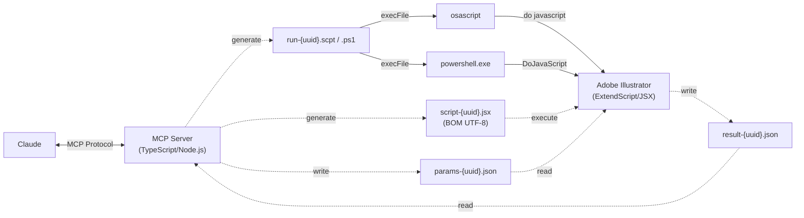

[🇺🇸 English](README.md) | [🇯🇵 日本語](README.ja.md) | [🇨🇳 简体中文](README.zh-CN.md) | [🇰🇷 한국어](README.ko.md) | [🇪🇸 Español](README.es.md) | **🇩🇪 Deutsch** | [🇫🇷 Français](README.fr.md) | [🇵🇹 Português (BR)](README.pt-BR.md)

# Illustrator MCP Server

[](https://www.npmjs.com/package/illustrator-mcp-server)
[](LICENSE)
[]()
[](https://www.adobe.com/products/illustrator.html)
[](https://modelcontextprotocol.io/)
[](https://ko-fi.com/cyocun)

Ein [MCP-Server (Model Context Protocol)](https://modelcontextprotocol.io/) zum Auslesen, Bearbeiten und Exportieren von Adobe-Illustrator-Designdaten — mit 63 integrierten Werkzeugen.

Steuere Illustrator direkt aus KI-Assistenten wie Claude — extrahiere Designinformationen für die Webumsetzung, prüfe druckfertige Daten und exportiere Assets.

[](https://glama.ai/mcp/servers/ie3jp/illustrator-mcp-server)

---

## 🎨 Galerie

Alle unten gezeigten Artworks wurden vollständig von Claude durch natürlichsprachige Konversation erstellt — ohne manuelle Bedienung von Illustrator.

<table>
<tr>
<td align="center"><br><b>Event-Poster</b></td>
<td align="center"><br><b>Logo-Konzepte</b></td>
</tr>
<tr>
<td align="center"><br><b>Visitenkarte</b></td>
<td align="center"><br><b>Twilight Geometry</b></td>
</tr>
</table>

> Siehe [ausführliche Aufschlüsselungen](#beispiel-smpte-testbild) weiter unten für Prompts, Tool-Einsatz und Zeichenflächen-Struktur.

---

> [!TIP]
> Die Entwicklung und Pflege dieses Tools kostet Zeit und Ressourcen.
> Wenn es Dir im Arbeitsalltag hilft, bedeutet Deine Unterstützung viel — [☕ spendier mir einen Kaffee!](https://ko-fi.com/cyocun)

---

## 🚀 Schnellstart

### 🛠️ Claude Code

Erfordert [Node.js 20+](https://nodejs.org/).

```bash
claude mcp add illustrator-mcp -- npx illustrator-mcp-server
```

### 🖥️ Claude Desktop

1. Lade **`illustrator-mcp-server.mcpb`** aus den [GitHub Releases](https://github.com/ie3jp/illustrator-mcp-server/releases/latest) herunter
2. Öffne Claude Desktop → **Settings** → **Extensions**
3. Ziehe die `.mcpb`-Datei per Drag & Drop in das Extensions-Panel
4. Klicke auf den Button **Install**

<details>
<summary><strong>Alternative: manuelle Konfiguration (immer aktuell via npx)</strong></summary>

> [!NOTE]
> Die `.mcpb`-Extension aktualisiert sich nicht automatisch. Lade zum Aktualisieren die neue Version herunter und installiere sie erneut. Wenn Du automatische Updates bevorzugst, verwende stattdessen die npx-Methode unten.

Erfordert [Node.js 20+](https://nodejs.org/). Öffne die Konfigurationsdatei und füge die Verbindungseinstellungen hinzu.

#### 1. Konfigurationsdatei öffnen

Aus der Claude-Desktop-Menüleiste:

**Claude** → **Settings...** → **Developer** (in der linken Seitenleiste) → Klicke auf den Button **Edit Config**

#### 2. Einstellungen hinzufügen

```json
{
  "mcpServers": {
    "illustrator": {
      "command": "npx",
      "args": ["illustrator-mcp-server"]
    }
  }
}
```

> [!NOTE]
> Wenn Du Node.js über einen Versionsmanager (nvm, mise, fnm usw.) installiert hast, findet Claude Desktop `npx` möglicherweise nicht. In diesem Fall gib den vollständigen Pfad an:
> ```json
> "command": "/full/path/to/npx"
> ```
> Führe `which npx` im Terminal aus, um den Pfad zu ermitteln.

#### 3. Speichern und neu starten

1. Speichere die Datei und schließe den Texteditor
2. **Beende Claude Desktop vollständig** (⌘Q / Ctrl+Q) und öffne es erneut

</details>

> [!CAUTION]
> KI kann Fehler machen. Verlasse Dich nicht zu sehr auf die Ausgabe — **die finale Kontrolle der Abgabedaten muss immer ein Mensch durchführen**. Die Nutzerin oder der Nutzer trägt die Verantwortung für die Ergebnisse.

> [!NOTE]
> **macOS:** Erlaube beim ersten Start den Automatisierungszugriff unter Systemeinstellungen > Datenschutz & Sicherheit > Automation.

> [!NOTE]
> Werkzeuge zum Bearbeiten und Exportieren bringen Illustrator während der Ausführung in den Vordergrund.

### Mehrere Illustrator-Versionen

Wenn Du mehrere Versionen von Illustrator installiert hast, kannst Du Claude im Gespräch mitteilen, welche Version verwendet werden soll. Sag einfach so etwas wie „Nutze Illustrator 2024" und das Werkzeug `set_illustrator_version` steuert diese Version an.

> [!NOTE]
> Wenn Illustrator bereits läuft, verbindet sich der Server unabhängig von der Versionseinstellung mit der laufenden Instanz. Die Version wird nur verwendet, um die korrekte Version zu starten, solange Illustrator noch nicht läuft.

---

## 🎬 Was Du tun kannst

```
Du:     Zeig mir alle Textinformationen in diesem Dokument
Claude:  → list_text_frames → get_text_frame_detail
         Im Dokument befinden sich 12 Textrahmen.
         Die Überschrift „My Design" verwendet Noto Sans JP Bold 48px, Farbe #333333 ...
```

```
Du:     Führe einen Preflight für die Druckvorstufe durch
Claude:  → preflight_check
         ⚠ 2 Warnungen:
         - Bild mit geringer Auflösung: image_01.jpg (150dpi) — 300dpi oder höher empfohlen
         - Nicht in Pfade umgewandelte Schriften: 3 Textrahmen
```

```
Du:     Prüfe Texte auf Inkonsistenzen
Claude:  → check_text_consistency
         📝 Konsistenzbericht:
         ⚠ „Contact Us" vs „Contact us" — abweichende Groß-/Kleinschreibung
         ❌ „Lorem ipsum" (an 2 Stellen) — Platzhaltertext verblieben
```

```
Du:     Erstelle Banner-Größenvarianten aus diesem A4-Flyer
Claude:  → get_document_info → resize_for_variation
         3 Größenvarianten erstellt:
         - 728×90 / 300×250 / 160×600
```

---

## 📖 Rezepte

<details>
<summary><b>Farben und Schriften für CSS extrahieren</b></summary>

```
Du:     Fasse die Farben und Typografie in diesem Design zusammen

Claude:  → get_colors → list_text_frames → get_text_frame_detail

         ■ Farbpalette
         - Primary: #1A73E8 (CMYK: 85,50,0,0)
         - Secondary: #34A853
         - Text: #202124
         - Hintergrund: #FFFFFF

         ■ Typografie
         - Überschriften: Noto Sans JP Bold / 32px
         - Fließtext: Noto Sans JP Regular / 16px / line-height: 1.75
         - Bildunterschriften: Noto Sans JP Medium / 12px
```

</details>

<details>
<summary><b>Zeichenflächen als SVG / PNG exportieren</b></summary>

```
Du:     Exportiere alle Zeichenflächen als SVG mit in Pfade umgewandeltem Text

Claude:  → get_artboards → convert_to_outlines → export (wiederholt)

         4 Zeichenflächen exportiert:
         - /output/header.svg
         - /output/hero.svg
         - /output/feature.svg
         - /output/footer.svg
```

</details>

<details>
<summary><b>PDF/X-1a-Konformität vor der Abgabe prüfen</b></summary>

```
Du:     Prüfe, ob dieses Dokument PDF/X-1a-konform ist

Claude:  → preflight_check (target_pdf_profile: "x1a")

         ❌ Fehler bei der PDF/X-1a-Konformität:
         - Transparenzen auf 3 Objekten (X-1a verbietet Transparenz)
         - RGB-Farben an 2 Stellen gefunden (X-1a verlangt ausschließlich CMYK/Sonderfarben)

         ⚠ Warnungen:
         - 5 nicht in Pfade umgewandelte Schriften (Einbetten empfohlen)
         - Bild „photo_02.jpg" mit 150dpi (300dpi empfohlen)
```

</details>

<details>
<summary><b>Bildqualität für den Druck prüfen</b></summary>

```
Du:     Prüfe die Qualität der platzierten Bilder für den Druck

Claude:  → get_images (include_print_info: true)

         ■ Bildqualitätsbericht:
         ✅ hero.psd — CMYK, 350dpi, Skalierung 98%
         ⚠ icon_set.png — RGB (Diskrepanz zum CMYK-Dokument), 300dpi, Skalierung 100%
         ❌ photo_bg.jpg — CMYK, 72dpi, Skalierung 400% (zu stark vergrößert)
           → Durch ein Bild mit 300dpi+ in Originalgröße ersetzen
```

</details>

<details>
<summary><b>WCAG-Farbkontrastverhältnisse prüfen</b></summary>

```
Du:     Prüfe die Textkontrastverhältnisse

Claude:  → check_contrast (auto_detect: true)

         ■ WCAG-Kontrastbericht:
         ❌ „Caption" auf „hellgrau" — 2.8:1 (AA nicht bestanden)
         ⚠ „Subheading" auf „weiß" — 4.2:1 (AA Large OK, AA Normal nicht bestanden)
         ✅ „Body text" auf „weiß" — 12.1:1 (AAA bestanden)
```

</details>

---

## Workflow-Vorlagen

Vorgefertigte Workflow-Vorlagen stehen im Prompt-Picker von Claude Desktop zur Verfügung.

| Vorlage | Beschreibung |
|----------|-------------|
| `quick-layout` | Text einfügen und Claude ordnet ihn auf der Zeichenfläche als Überschrift, Fließtext und Bildunterschrift an |
| `print-preflight-workflow` | Umfassende 7-stufige Druckvorstufen-Prüfung (Dokument → Preflight → Überdrucken → Farbauszüge → Bilder → Farben → Text) |

---

## Werkzeug-Referenz

### Read-Werkzeuge (21)

<details>
<summary>Zum Aufklappen klicken</summary>

| Werkzeug | Beschreibung |
|---|---|
| `get_document_info` | Dokument-Metadaten (Maße, Farbmodus, Profil usw.) |
| `get_artboards` | Informationen zu Zeichenflächen (Position, Größe, Ausrichtung) |
| `get_layers` | Ebenenstruktur als Baum |
| `get_document_structure` | Vollständiger Baum: Ebenen → Gruppen → Objekte in einem Aufruf |
| `list_text_frames` | Liste der Textrahmen (Schrift, Größe, Stilname) |
| `get_text_frame_detail` | Alle Attribute eines bestimmten Textrahmens (Unterschneidung, Absatzeinstellungen usw.) |
| `get_colors` | Verwendete Farbinformationen (Farbfelder, Verläufe, Sonderfarben). `include_diagnostics` für Druckanalyse |
| `get_path_items` | Pfad-/Formdaten (Füllung, Kontur, Ankerpunkte) |
| `get_groups` | Gruppen, Schnittmasken und zusammengesetzte Pfadstruktur |
| `get_effects` | Effekte und Aussehen-Infos (Deckkraft, Füllmethode) |
| `get_images` | Info zu eingebetteten/verknüpften Bildern (Auflösung, Erkennung defekter Verknüpfungen). `include_print_info` für Farbraum-Diskrepanz und Skalierungsfaktor |
| `get_symbols` | Symboldefinitionen und -instanzen |
| `get_guidelines` | Informationen zu Hilfslinien |
| `get_overprint_info` | Überdrucken-Einstellungen + K100/Tiefschwarz-Erkennung und Klassifizierung der Absicht |
| `get_separation_info` | Farbauszugs-Info (CMYK-Prozessplatten + Sonderfarbenplatten mit Nutzungszählung) |
| `get_selection` | Details der aktuell ausgewählten Objekte |
| `find_objects` | Suche nach Kriterien (Name, Typ, Farbe, Schrift usw.) |
| `check_contrast` | Prüfung des WCAG-Farbkontrasts (manuell oder automatische Erkennung überlappender Paare) |
| `extract_design_tokens` | Design-Tokens als CSS Custom Properties, JSON oder Tailwind-Config extrahieren |
| `list_fonts` | Listet in Illustrator verfügbare Schriften auf (kein Dokument erforderlich) |
| `convert_coordinate` | Punkte zwischen Zeichenflächen- und Dokument-Koordinatensystemen umrechnen |

</details>

### Modify-Werkzeuge (38)

<details>
<summary>Zum Aufklappen klicken</summary>

| Werkzeug | Beschreibung |
|---|---|
| `create_rectangle` | Rechteck erstellen (unterstützt abgerundete Ecken) |
| `create_ellipse` | Ellipse erstellen |
| `create_line` | Linie erstellen |
| `create_text_frame` | Textrahmen erstellen (Punkt- oder Flächentext) |
| `create_path` | Benutzerdefinierten Pfad erstellen (mit Bézier-Griffen) |
| `place_image` | Eine Bilddatei verknüpft oder eingebettet platzieren |
| `modify_object` | Eigenschaften eines vorhandenen Objekts ändern |
| `convert_to_outlines` | Text in Pfade umwandeln |
| `assign_color_profile` | Ein Farbprofil zuweisen (taggen) (konvertiert keine Farbwerte) |
| `create_document` | Neues Dokument erstellen (Größe, Farbmodus) |
| `close_document` | Aktives Dokument schließen |
| `resize_for_variation` | Größenvarianten aus einer Quell-Zeichenfläche erstellen (proportionale Skalierung) |
| `align_objects` | Mehrere Objekte ausrichten und verteilen |
| `replace_color` | Farben dokumentweit suchen und ersetzen (mit Toleranz) |
| `manage_layers` | Ebenen hinzufügen, umbenennen, ein-/ausblenden, sperren/entsperren, neu anordnen oder löschen |
| `place_color_chips` | Eindeutige Farben extrahieren und Farbfeld-Swatches außerhalb der Zeichenfläche platzieren |
| `save_document` | Aktives Dokument speichern oder „Speichern unter" |
| `open_document` | Ein Dokument aus einem Dateipfad öffnen |
| `group_objects` | Objekte gruppieren (unterstützt Schnittmasken) |
| `ungroup_objects` | Eine Gruppe auflösen und Kinder freigeben |
| `duplicate_objects` | Objekte duplizieren mit optionalem Versatz |
| `set_z_order` | Stapelreihenfolge ändern (vorn/hinten) |
| `move_to_layer` | Objekte auf eine andere Ebene verschieben |
| `manage_artboards` | Zeichenflächen hinzufügen, entfernen, skalieren, umbenennen, neu anordnen |
| `manage_swatches` | Farbfelder hinzufügen, aktualisieren oder löschen |
| `manage_linked_images` | Platzierte Bilder neu verknüpfen oder einbetten |
| `manage_datasets` | Datensätze auflisten/anwenden/erstellen, Variablen importieren/exportieren |
| `apply_graphic_style` | Einen Grafikstil auf Objekte anwenden |
| `list_graphic_styles` | Alle Grafikstile im Dokument auflisten |
| `apply_text_style` | Zeichen- oder Absatzformat auf Text anwenden |
| `list_text_styles` | Alle Zeichen- und Absatzformate auflisten |
| `create_gradient` | Verläufe erstellen und auf Objekte anwenden |
| `create_path_text` | Text entlang eines Pfads erstellen |
| `place_symbol` | Symbolinstanzen platzieren oder ersetzen |
| `select_objects` | Objekte nach UUID auswählen (Mehrfachauswahl unterstützt) |
| `create_crop_marks` | Schnittmarken (Beschnittzeichen) erstellen mit automatischer Stilerkennung nach Locale (japanische Doppellinie / westliche Einzellinie) |
| `place_style_guide` | Einen visuellen Styleguide außerhalb der Zeichenfläche platzieren (Farben, Schriften, Abstände, Ränder, Hilfslinienabstände) |
| `undo` | Rückgängig-/Wiederholen-Operationen (mehrstufig) |

</details>

### Export-Werkzeuge (2)

<details>
<summary>Zum Aufklappen klicken</summary>

| Werkzeug | Beschreibung |
|---|---|
| `export` | SVG- / PNG- / JPG-Export (nach Zeichenfläche, Auswahl oder UUID) |
| `export_pdf` | Druckfertiger PDF-Export (Schnittmarken, Beschnitt, selektive Neuberechnung der Auflösung, Output Intent) |

</details>

### Utility (3)

<details>
<summary>Zum Aufklappen klicken</summary>

| Werkzeug | Beschreibung |
|---|---|
| `preflight_check` | Druckvorstufen-Prüfung (RGB-Vermischung, defekte Verknüpfungen, niedrige Auflösung, Weißüberdruck, Zusammenspiel von Transparenz und Überdrucken, PDF/X-Konformität usw.) |
| `check_text_consistency` | Textkonsistenzprüfung (Platzhaltererkennung, Schreibweisen-Abweichungen, vollständige Textauflistung für LLM-Analyse) |
| `set_workflow` | Workflow-Modus setzen (web/print), um das automatisch erkannte Koordinatensystem zu überschreiben |

</details>

---

## Koordinatensystem

Der Server erkennt das Koordinatensystem automatisch anhand des Dokuments:

| Dokumenttyp | Koordinatensystem | Ursprung | Y-Achse |
|---|---|---|---|
| CMYK / Print | `document` | unten links | nach oben |
| RGB / Web | `artboard-web` | oben links der Zeichenfläche | nach unten |

- **CMYK-Dokumente** verwenden das native Koordinatensystem von Illustrator, das den Erwartungen von Druckdesignerinnen und Druckdesignern entspricht
- **RGB-Dokumente** verwenden ein web-artiges Koordinatensystem, mit dem die KI leichter arbeiten kann
- Verwende `set_workflow`, um das automatisch erkannte Koordinatensystem bei Bedarf zu überschreiben
- Alle Tool-Antworten enthalten ein Feld `coordinateSystem`, das angibt, welches System aktiv ist

---

## Beispiel: SMPTE-Testbild

Ein 1920×1080 SMPTE-Farbbalken-Testbild, vollständig durch natürlichsprachige Anweisungen an Claude erstellt.

**Prompt:**

> Erstelle ein 1920x1080 Video-Testbild

**Ergebnis:**


**Zeichenflächen-Struktur** (via `get_document_structure`):

<details>
<summary>Zum Aufklappen klicken</summary>

```
Labels
├── title-safe-label        (text)    — "TITLE SAFE (10%)"
├── action-safe-label       (text)    — "ACTION SAFE (5%)"
├── credit-label            (text)    — "Generated by illustrator-mcp-server"
├── test-label              (text)    — "SMPTE COLOR BARS — TEST PATTERN"
├── format-label            (text)    — "Full HD — 16:9"
└── resolution-label        (text)    — "1920 x 1080"

Center Cross
├── title-safe              (path)    — 1536×864 stroke rectangle
├── action-safe             (path)    — 1728×972 stroke rectangle
├── cross-circle            (path)    — 150×150 center circle
├── cross-v                 (path)    — vertical crosshair
└── cross-h                 (path)    — horizontal crosshair

Color Bars
├── pluge-black … pluge-navy   (path ×9)  — PLUGE / grayscale bottom strip
├── rev-white … rev-blue       (path ×7)  — reverse color middle strip
└── bar-white … bar-blue       (path ×7)  — 75% SMPTE color bars
```

</details>

> Verwendete Werkzeuge: `create_document`, `manage_layers`, `create_rectangle` ×23, `create_line` ×2, `create_ellipse`, `create_text_frame` ×6, `modify_object` ×4, `save_document`, `export`

---

## Beispiel: Twilight Geometry

Eine abstrakte, geometrische Landschaftsgrafik — vollständig von Claude erstellt, ohne weitere menschliche Designvorgabe als „mach, worauf Du Lust hast".

**Prompt:**

> Make an art piece of your own imagination in Illustrator. Take your time. Create whatever you like.

**Claudes Vorgehen:**

> Ich erstelle „Twilight Geometry" — eine abstrakte Landschaft mit geometrischen Himmelselementen. Ein tiefer Verlauf als Dämmerhimmel, geschichtete Berg-Silhouetten, ein Halbmond mit dekorativen Ringen und über die Leinwand verstreute Sterne.

> Rautenförmige Sterne in verschiedenen Farben — warme Weißtöne, kühles Blau, lavendelfarbenes Violett — jeder einzelne leicht unterschiedlich, um verschiedene Sterntypen anzudeuten. Konstellationslinien verbinden sie. Drahtgitter-Dreiecke und ein Hexagon schweben am Himmel für eine mystische Atmosphäre.

> Am unteren Rand eine Wasseroberfläche, in der sich das Mondlicht als schimmernde Wellenlinien spiegelt, die nach unten hin ausblenden.

**Claudes Reflexion:**

> Es ist besser geworden, als ich erwartet hatte. Ich finde, die Mischwelt aus Geometrie und Natur ist gut rübergekommen.

**Ergebnis:**


> Verwendete Werkzeuge: `create_document`, `manage_layers` ×4, `create_rectangle` ×2, `create_gradient` ×2, `create_path` ×11, `create_ellipse` ×14, `create_line` ×4, `create_text_frame` ×2, `modify_object`, `set_z_order`, `export`

---

## Bekannte Einschränkungen

| Einschränkung | Details |
|---|---|
| Windows-Unterstützung | Windows nutzt PowerShell-COM-Automatisierung (noch nicht auf echter Hardware getestet) |
| Live-Effekte | Parameter von Schlagschatten und anderen Effekten können erkannt, aber nicht ausgelesen werden |
| Farbprofile | Nur Zuweisung von Farbprofilen — eine vollständige Konvertierung ist nicht verfügbar |
| Beschnittseinstellungen | Beschnittseinstellungen können nicht ausgelesen werden (Einschränkung der Illustrator-API) |
| WebP-Export | Nicht unterstützt — verwende stattdessen PNG oder SVG |
| Japanische Schnittmarken | Der PDF-Export verwendet automatisch den TrimMark-Befehl: Marken werden als Dokumentpfade erzeugt, exportiert und anschließend per Undo entfernt |
| Einbetten von Schriften | Einbettungsmodus (vollständig/Subset) kann nicht direkt gesteuert werden — nutze PDF-Vorgaben |
| Größenvarianten | Nur proportionale Skalierung — Text muss ggf. anschließend manuell nachjustiert werden |

---

<br>

# Für Entwicklerinnen und Entwickler

## Architektur



---

## Aus dem Quellcode bauen

```bash
git clone https://github.com/ie3jp/illustrator-mcp-server.git
cd illustrator-mcp-server
npm install
npm run build
claude mcp add illustrator-mcp -- node /path/to/illustrator-mcp-server/dist/index.js
```

### Überprüfen

```bash
npx @modelcontextprotocol/inspector npx illustrator-mcp-server
```

### Tests

```bash
# Unit-Tests
npm test

# E2E-Smoketest (Illustrator muss laufen)
npx tsx test/e2e/smoke-test.ts
```

Der E2E-Test erstellt frische Dokumente (RGB + CMYK), platziert Testobjekte, führt 182 Testfälle in 10 Phasen aus, die alle registrierten Werkzeuge sowie die automatische Erkennung des Koordinatensystems abdecken, und räumt am Ende automatisch auf.

---

## Haftungsausschluss

Dieses Tool automatisiert viele Illustrator-Operationen, aber KI kann Fehler machen. Extrahierte Daten, Preflight-Ergebnisse und Dokumentänderungen sollten immer von einem Menschen überprüft werden. **Verlasse Dich nicht auf dieses Tool als Deine einzige Qualitätskontrolle.** Nutze es als Assistenz neben Deiner eigenen manuellen Prüfung, besonders bei Druckabgaben und Kundenlieferungen. Die Autorinnen und Autoren übernehmen keine Haftung für Schäden oder Verluste, die aus der Nutzung dieser Software oder ihrer Ergebnisse entstehen.

---

## Lizenz

[MIT](LICENSE)
