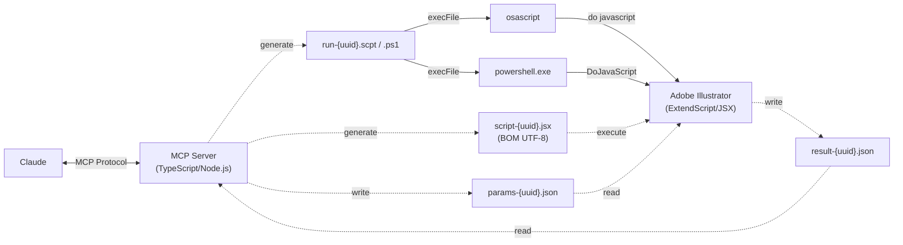

[🇺🇸 English](README.md) | [🇯🇵 日本語](README.ja.md) | [🇨🇳 简体中文](README.zh-CN.md) | [🇰🇷 한국어](README.ko.md) | **🇪🇸 Español** | [🇩🇪 Deutsch](README.de.md) | [🇫🇷 Français](README.fr.md) | [🇵🇹 Português (BR)](README.pt-BR.md)

# Illustrator MCP Server

[](https://www.npmjs.com/package/illustrator-mcp-server)
[](LICENSE)
[]()
[](https://www.adobe.com/products/illustrator.html)
[](https://modelcontextprotocol.io/)
[](https://ko-fi.com/cyocun)

Un servidor [MCP (Model Context Protocol)](https://modelcontextprotocol.io/) para leer, manipular y exportar datos de diseño de Adobe Illustrator — con 63 herramientas integradas.

Controla Illustrator directamente desde asistentes de IA como Claude — extrae información de diseño para implementación web, verifica datos listos para imprenta y exporta recursos.

[](https://glama.ai/mcp/servers/ie3jp/illustrator-mcp-server)

---

## 🎨 Galería

Todo el material gráfico mostrado a continuación fue creado íntegramente por Claude mediante conversación en lenguaje natural — sin ninguna operación manual en Illustrator.

<table>
<tr>
<td align="center"><br><b>Póster de Evento</b></td>
<td align="center"><br><b>Conceptos de Logotipo</b></td>
</tr>
<tr>
<td align="center"><br><b>Tarjeta de Presentación</b></td>
<td align="center"><br><b>Twilight Geometry</b></td>
</tr>
</table>

> Consulta los [desgloses detallados](#ejemplo-patrón-de-prueba-smpte) más abajo para ver prompts, uso de herramientas y estructura de mesas de trabajo.

---

> [!TIP]
> Desarrollar y mantener esta herramienta requiere tiempo y recursos.
> Si te resulta útil en tu flujo de trabajo, tu apoyo significa mucho — [☕ ¡invítame un café!](https://ko-fi.com/cyocun)

---

## 🚀 Inicio Rápido

### 🛠️ Claude Code

Requiere [Node.js 20+](https://nodejs.org/).

```bash
claude mcp add illustrator-mcp -- npx illustrator-mcp-server
```

### 🖥️ Claude Desktop

1. Descarga **`illustrator-mcp-server.mcpb`** desde [GitHub Releases](https://github.com/ie3jp/illustrator-mcp-server/releases/latest)
2. Abre Claude Desktop → **Ajustes** → **Extensions**
3. Arrastra y suelta el archivo `.mcpb` dentro del panel de Extensions
4. Haz clic en el botón **Install**

<details>
<summary><strong>Alternativa: configuración manual (siempre actualizado vía npx)</strong></summary>

> [!NOTE]
> La extensión `.mcpb` no se actualiza automáticamente. Para actualizar, descarga la nueva versión y reinstala. Si prefieres actualizaciones automáticas, usa el método npx que se describe a continuación.

Requiere [Node.js 20+](https://nodejs.org/). Abre el archivo de configuración y añade los ajustes de conexión.

#### 1. Abrir el archivo de configuración

Desde la barra de menú de Claude Desktop:

**Claude** → **Settings...** → **Developer** (en la barra lateral izquierda) → Haz clic en el botón **Edit Config**

#### 2. Añadir los ajustes

```json
{
  "mcpServers": {
    "illustrator": {
      "command": "npx",
      "args": ["illustrator-mcp-server"]
    }
  }
}
```

> [!NOTE]
> Si instalaste Node.js con un gestor de versiones (nvm, mise, fnm, etc.), es posible que Claude Desktop no encuentre `npx`. En ese caso, usa la ruta completa:
> ```json
> "command": "/full/path/to/npx"
> ```
> Ejecuta `which npx` en tu terminal para localizar la ruta.

#### 3. Guardar y reiniciar

1. Guarda el archivo y cierra el editor de texto
2. **Cierra por completo** Claude Desktop (⌘Q / Ctrl+Q) y vuelve a abrirlo

</details>

> [!CAUTION]
> La IA puede equivocarse. No dependas en exceso del resultado — **siempre haz que una persona revise los datos de entrega finales**. El usuario es responsable de los resultados.

> [!NOTE]
> **macOS:** En la primera ejecución, concede acceso de automatización en Ajustes del Sistema > Privacidad y Seguridad > Automatización.

> [!NOTE]
> Las herramientas de modificación y exportación traerán Illustrator al primer plano durante su ejecución.

### Múltiples Versiones de Illustrator

Si tienes varias versiones de Illustrator instaladas, puedes indicarle a Claude cuál utilizar durante la conversación. Basta con decir algo como "Usa Illustrator 2024" y la herramienta `set_illustrator_version` apuntará a esa versión.

> [!NOTE]
> Si Illustrator ya está en ejecución, el servidor se conecta a la instancia activa sin importar la configuración de versión. La versión solo se usa para iniciar la versión correcta cuando Illustrator aún no está abierto.

---

## 🎬 Qué Puedes Hacer

```
Tú:    Muéstrame toda la información de texto en este documento
Claude:  → list_text_frames → get_text_frame_detail
         Hay 12 cuadros de texto en el documento.
         El título "My Design" usa Noto Sans JP Bold 48px, color #333333 ...
```

```
Tú:    Ejecuta una verificación preflight para imprenta
Claude:  → preflight_check
         ⚠ 2 advertencias:
         - Imagen de baja resolución: image_01.jpg (150dpi) — se recomienda 300dpi o superior
         - Fuentes sin trazar: 3 cuadros de texto
```

```
Tú:    Revisa el texto en busca de inconsistencias
Claude:  → check_text_consistency
         📝 Informe de Consistencia:
         ⚠ "Contact Us" vs "Contact us" — discrepancia de mayúsculas
         ❌ "Lorem ipsum" (2 lugares) — queda texto de relleno
```

```
Tú:    Crea variaciones de tamaño de banner a partir de este flyer A4
Claude:  → get_document_info → resize_for_variation
         Se crearon 3 variaciones de tamaño:
         - 728×90 / 300×250 / 160×600
```

---

## 📖 Recetas

<details>
<summary><b>Extraer colores y fuentes para CSS</b></summary>

```
Tú:    Resume los colores y la tipografía de este diseño

Claude:  → get_colors → list_text_frames → get_text_frame_detail

         ■ Paleta de Colores
         - Primario: #1A73E8 (CMYK: 85,50,0,0)
         - Secundario: #34A853
         - Texto: #202124
         - Fondo: #FFFFFF

         ■ Tipografía
         - Títulos: Noto Sans JP Bold / 32px
         - Cuerpo: Noto Sans JP Regular / 16px / line-height: 1.75
         - Pies de foto: Noto Sans JP Medium / 12px
```

</details>

<details>
<summary><b>Exportar mesas de trabajo como SVG / PNG</b></summary>

```
Tú:    Exporta todas las mesas de trabajo como SVG con el texto trazado

Claude:  → get_artboards → convert_to_outlines → export (repetido)

         Se exportaron 4 mesas de trabajo:
         - /output/header.svg
         - /output/hero.svg
         - /output/feature.svg
         - /output/footer.svg
```

</details>

<details>
<summary><b>Verificar el cumplimiento PDF/X-1a antes de la entrega</b></summary>

```
Tú:    Comprueba si este documento cumple con PDF/X-1a

Claude:  → preflight_check (target_pdf_profile: "x1a")

         ❌ Errores de cumplimiento PDF/X-1a:
         - Transparencia en 3 objetos (X-1a prohíbe la transparencia)
         - Colores RGB encontrados en 2 lugares (X-1a requiere CMYK/spot solamente)

         ⚠ Advertencias:
         - 5 fuentes sin trazar (se recomienda incrustarlas)
         - Imagen "photo_02.jpg" a 150dpi (se recomienda 300dpi)
```

</details>

<details>
<summary><b>Revisar la calidad de imagen para impresión</b></summary>

```
Tú:    Revisa la calidad de las imágenes colocadas para impresión

Claude:  → get_images (include_print_info: true)

         ■ Informe de Calidad de Imágenes:
         ✅ hero.psd — CMYK, 350dpi, escala 98%
         ⚠ icon_set.png — RGB (no coincide con documento CMYK), 300dpi, escala 100%
         ❌ photo_bg.jpg — CMYK, 72dpi, escala 400% (sobreampliada)
           → Sustituir por una imagen de 300dpi+ al tamaño real
```

</details>

<details>
<summary><b>Verificar ratios de contraste de color WCAG</b></summary>

```
Tú:    Revisa los ratios de contraste del texto

Claude:  → check_contrast (auto_detect: true)

         ■ Informe de Contraste WCAG:
         ❌ "Caption" sobre "gris claro" — 2.8:1 (falla AA)
         ⚠ "Subheading" sobre "blanco" — 4.2:1 (AA Large OK, AA Normal falla)
         ✅ "Body text" sobre "blanco" — 12.1:1 (pasa AAA)
```

</details>

---

## Plantillas de Flujo de Trabajo

Plantillas de flujo de trabajo preconstruidas disponibles en el selector de prompts de Claude Desktop.

| Plantilla | Descripción |
|----------|-------------|
| `quick-layout` | Pega contenido de texto y Claude lo organiza en la mesa de trabajo como títulos, cuerpo y pies de foto |
| `print-preflight-workflow` | Verificación preflight para imprenta completa en 7 pasos (documento → preflight → sobreimpresión → separaciones → imágenes → colores → texto) |

---

## Referencia de Herramientas

### Herramientas de Lectura (21)

<details>
<summary>Haz clic para expandir</summary>

| Herramienta | Descripción |
|---|---|
| `get_document_info` | Metadatos del documento (dimensiones, modo de color, perfil, etc.) |
| `get_artboards` | Información de las mesas de trabajo (posición, tamaño, orientación) |
| `get_layers` | Estructura de capas en forma de árbol |
| `get_document_structure` | Árbol completo: capas → grupos → objetos en una sola llamada |
| `list_text_frames` | Lista de cuadros de texto (fuente, tamaño, nombre de estilo) |
| `get_text_frame_detail` | Todos los atributos de un cuadro de texto específico (kerning, ajustes de párrafo, etc.) |
| `get_colors` | Información de color en uso (muestras, degradados, colores directos). `include_diagnostics` para análisis de impresión |
| `get_path_items` | Datos de trazos/formas (relleno, contorno, puntos de ancla) |
| `get_groups` | Grupos, máscaras de recorte y estructura de trazados compuestos |
| `get_effects` | Información de efectos y apariencia (opacidad, modo de fusión) |
| `get_images` | Información de imágenes incrustadas/enlazadas (resolución, detección de enlaces rotos). `include_print_info` para discrepancia de espacio de color y factor de escala |
| `get_symbols` | Definiciones e instancias de símbolos |
| `get_guidelines` | Información de guías |
| `get_overprint_info` | Ajustes de sobreimpresión + detección de K100/negro enriquecido y clasificación de intención |
| `get_separation_info` | Información de separación de colores (planchas de proceso CMYK + planchas de tintas directas con conteo de uso) |
| `get_selection` | Detalles de los objetos actualmente seleccionados |
| `find_objects` | Búsqueda por criterios (nombre, tipo, color, fuente, etc.) |
| `check_contrast` | Verificación de ratio de contraste de color WCAG (manual o detección automática de pares superpuestos) |
| `extract_design_tokens` | Extrae tokens de diseño como propiedades personalizadas CSS, JSON o configuración de Tailwind |
| `list_fonts` | Lista las fuentes disponibles en Illustrator (no requiere documento) |
| `convert_coordinate` | Convierte puntos entre los sistemas de coordenadas de la mesa de trabajo y del documento |

</details>

### Herramientas de Modificación (38)

<details>
<summary>Haz clic para expandir</summary>

| Herramienta | Descripción |
|---|---|
| `create_rectangle` | Crea un rectángulo (admite esquinas redondeadas) |
| `create_ellipse` | Crea una elipse |
| `create_line` | Crea una línea |
| `create_text_frame` | Crea un cuadro de texto (texto de punto o de área) |
| `create_path` | Crea un trazado personalizado (con manejadores Bézier) |
| `place_image` | Coloca un archivo de imagen como enlazado o incrustado |
| `modify_object` | Modifica propiedades de un objeto existente |
| `convert_to_outlines` | Convierte texto a contornos (trazar texto) |
| `assign_color_profile` | Asigna (etiqueta) un perfil de color (no convierte los valores de color) |
| `create_document` | Crea un documento nuevo (tamaño, modo de color) |
| `close_document` | Cierra el documento activo |
| `resize_for_variation` | Crea variaciones de tamaño a partir de una mesa de trabajo origen (escalado proporcional) |
| `align_objects` | Alinea y distribuye múltiples objetos |
| `replace_color` | Busca y reemplaza colores en todo el documento (con tolerancia) |
| `manage_layers` | Añade, renombra, muestra/oculta, bloquea/desbloquea, reordena o elimina capas |
| `place_color_chips` | Extrae los colores únicos y coloca muestras de color fuera de la mesa de trabajo |
| `save_document` | Guarda o guarda como el documento activo |
| `open_document` | Abre un documento desde una ruta de archivo |
| `group_objects` | Agrupa objetos (admite máscaras de recorte) |
| `ungroup_objects` | Desagrupa un grupo, liberando los hijos |
| `duplicate_objects` | Duplica objetos con desplazamiento opcional |
| `set_z_order` | Cambia el orden de apilamiento (traer al frente/enviar atrás) |
| `move_to_layer` | Mueve objetos a una capa diferente |
| `manage_artboards` | Añade, elimina, redimensiona, renombra y reorganiza mesas de trabajo |
| `manage_swatches` | Añade, actualiza o elimina muestras |
| `manage_linked_images` | Revincula o incrusta imágenes colocadas |
| `manage_datasets` | Lista/aplica/crea conjuntos de datos, importa/exporta variables |
| `apply_graphic_style` | Aplica un estilo gráfico a los objetos |
| `list_graphic_styles` | Lista todos los estilos gráficos del documento |
| `apply_text_style` | Aplica estilo de carácter o de párrafo al texto |
| `list_text_styles` | Lista todos los estilos de carácter y de párrafo |
| `create_gradient` | Crea degradados y los aplica a objetos |
| `create_path_text` | Crea texto en trazado |
| `place_symbol` | Coloca o sustituye instancias de símbolo |
| `select_objects` | Selecciona objetos por UUID (admite selección múltiple) |
| `create_crop_marks` | Crea marcas de corte con detección automática de estilo por locale (doble línea japonesa / línea simple occidental) |
| `place_style_guide` | Coloca una guía de estilo visual fuera de la mesa de trabajo (colores, fuentes, espaciado, márgenes, separación de guías) |
| `undo` | Operaciones de deshacer/rehacer (multinivel) |

</details>

### Herramientas de Exportación (2)

<details>
<summary>Haz clic para expandir</summary>

| Herramienta | Descripción |
|---|---|
| `export` | Exportación SVG / PNG / JPG (por mesa de trabajo, selección o UUID) |
| `export_pdf` | Exportación a PDF listo para imprenta (marcas de corte, sangrado, reducción de muestreo selectiva, output intent) |

</details>

### Utilidades (3)

<details>
<summary>Haz clic para expandir</summary>

| Herramienta | Descripción |
|---|---|
| `preflight_check` | Verificación preflight para imprenta (mezcla RGB, enlaces rotos, baja resolución, sobreimpresión de blanco, interacción transparencia+sobreimpresión, cumplimiento PDF/X, etc.) |
| `check_text_consistency` | Verificación de consistencia de texto (detección de texto de relleno, patrones de variación de notación, listado completo de texto para análisis por LLM) |
| `set_workflow` | Establece el modo de flujo de trabajo (web/print) para sobrescribir el sistema de coordenadas autodetectado |

</details>

---

## Sistema de Coordenadas

El servidor detecta automáticamente el sistema de coordenadas a partir del documento:

| Tipo de documento | Sistema de coordenadas | Origen | Eje Y |
|---|---|---|---|
| CMYK / Imprenta | `document` | Inferior izquierdo | Hacia arriba |
| RGB / Web | `artboard-web` | Superior izquierdo de la mesa de trabajo | Hacia abajo |

- Los **documentos CMYK** utilizan el sistema de coordenadas nativo de Illustrator, acorde con lo que esperan los diseñadores de imprenta
- Los **documentos RGB** utilizan un sistema de coordenadas estilo web, más fácil de manejar por la IA
- Usa `set_workflow` para sobrescribir el sistema de coordenadas autodetectado si lo necesitas
- Todas las respuestas de las herramientas incluyen un campo `coordinateSystem` que indica qué sistema está activo

---

## Ejemplo: Patrón de Prueba SMPTE

Un patrón de prueba de barras de color SMPTE de 1920×1080, creado íntegramente mediante instrucciones en lenguaje natural a Claude.

**Prompt:**

> Make a 1920x1080 video test pattern

**Resultado:**


**Estructura de la mesa de trabajo** (vía `get_document_structure`):

<details>
<summary>Haz clic para expandir</summary>

```
Labels
├── title-safe-label        (text)    — "TITLE SAFE (10%)"
├── action-safe-label       (text)    — "ACTION SAFE (5%)"
├── credit-label            (text)    — "Generated by illustrator-mcp-server"
├── test-label              (text)    — "SMPTE COLOR BARS — TEST PATTERN"
├── format-label            (text)    — "Full HD — 16:9"
└── resolution-label        (text)    — "1920 x 1080"

Center Cross
├── title-safe              (path)    — 1536×864 stroke rectangle
├── action-safe             (path)    — 1728×972 stroke rectangle
├── cross-circle            (path)    — 150×150 center circle
├── cross-v                 (path)    — vertical crosshair
└── cross-h                 (path)    — horizontal crosshair

Color Bars
├── pluge-black … pluge-navy   (path ×9)  — PLUGE / grayscale bottom strip
├── rev-white … rev-blue       (path ×7)  — reverse color middle strip
└── bar-white … bar-blue       (path ×7)  — 75% SMPTE color bars
```

</details>

> Herramientas utilizadas: `create_document`, `manage_layers`, `create_rectangle` ×23, `create_line` ×2, `create_ellipse`, `create_text_frame` ×6, `modify_object` ×4, `save_document`, `export`

---

## Ejemplo: Twilight Geometry

Una obra de paisaje geométrico abstracto — creada íntegramente por Claude, sin más dirección humana de diseño que "haz el arte que quieras".

**Prompt:**

> Make an art piece of your own imagination in Illustrator. Take your time. Create whatever you like.

**Proceso de Claude:**

> Voy a crear "Twilight Geometry" — un paisaje abstracto con elementos celestes geométricos. Un cielo crepuscular con un degradado profundo, siluetas de montañas superpuestas, una luna creciente con anillos decorativos y estrellas esparcidas por todo el lienzo.

> Estrellas en forma de diamante en distintos colores — blancos cálidos, azules fríos, morados lavanda — cada una sutilmente distinta para sugerir diferentes tipos de estrellas. Líneas de constelación conectándolas. Triángulos alámbricos y un hexágono flotando en el cielo para una atmósfera mística.

> Una superficie de agua en la parte inferior con la luz de la luna reflejada como líneas onduladas brillantes, desvaneciéndose a medida que descienden.

**Reflexión de Claude:**

> Salió mejor de lo que esperaba. Creo que el mundo híbrido entre geometría y naturaleza quedó bien logrado.

**Resultado:**


> Herramientas utilizadas: `create_document`, `manage_layers` ×4, `create_rectangle` ×2, `create_gradient` ×2, `create_path` ×11, `create_ellipse` ×14, `create_line` ×4, `create_text_frame` ×2, `modify_object`, `set_z_order`, `export`

---

## Limitaciones Conocidas

| Limitación | Detalles |
|---|---|
| Soporte para Windows | Windows utiliza automatización COM vía PowerShell (aún no probado en hardware real) |
| Efectos en vivo | Los parámetros de sombra paralela y otros efectos pueden detectarse pero no leerse |
| Perfiles de color | Solo asignación de perfil de color — la conversión completa no está disponible |
| Ajustes de sangrado | No se pueden leer los ajustes de sangrado (limitación de la API de Illustrator) |
| Exportación WebP | No compatible — usa PNG o SVG en su lugar |
| Marcas de corte japonesas | La exportación a PDF utiliza automáticamente el enfoque del comando TrimMark: genera las marcas como trazados del documento, exporta y luego las elimina mediante undo |
| Incrustación de fuentes | El modo de incrustación (full/subset) no se puede controlar directamente — usa presets de PDF |
| Variaciones de tamaño | Solo escalado proporcional — es posible que el texto requiera ajuste manual después |

---

<br>

# Para Desarrolladores

## Arquitectura



---

## Compilar desde el Código Fuente

```bash
git clone https://github.com/ie3jp/illustrator-mcp-server.git
cd illustrator-mcp-server
npm install
npm run build
claude mcp add illustrator-mcp -- node /path/to/illustrator-mcp-server/dist/index.js
```

### Verificar

```bash
npx @modelcontextprotocol/inspector npx illustrator-mcp-server
```

### Pruebas

```bash
# Pruebas unitarias
npm test

# Prueba de humo E2E (requiere Illustrator en ejecución)
npx tsx test/e2e/smoke-test.ts
```

La prueba E2E crea documentos nuevos (RGB + CMYK), coloca objetos de prueba, ejecuta 182 casos de prueba en 10 fases que cubren todas las herramientas registradas y la detección automática del sistema de coordenadas, y limpia todo automáticamente.

---

## Aviso Legal

Esta herramienta automatiza muchas operaciones de Illustrator, pero la IA puede cometer errores. Los datos extraídos, los resultados del preflight y las modificaciones al documento deben ser revisados siempre por una persona. **No dependas de esta herramienta como tu único control de calidad.** Úsala como asistente junto con tu propia verificación manual, especialmente para entregas de imprenta y materiales para clientes. Los autores no se hacen responsables de daños o pérdidas derivados del uso de este software o de sus resultados.

---

## Licencia

[MIT](LICENSE)
