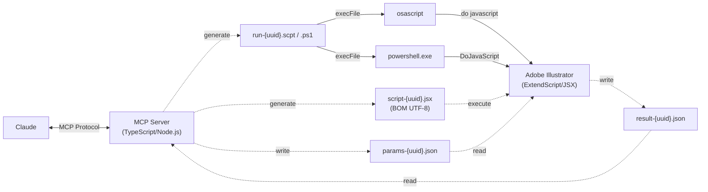

[🇺🇸 English](README.md) | [🇯🇵 日本語](README.ja.md) | [🇨🇳 简体中文](README.zh-CN.md) | [🇰🇷 한국어](README.ko.md) | [🇪🇸 Español](README.es.md) | [🇩🇪 Deutsch](README.de.md) | **🇫🇷 Français** | [🇵🇹 Português (BR)](README.pt-BR.md)

# Illustrator MCP Server

[](https://www.npmjs.com/package/illustrator-mcp-server)
[](LICENSE)
[]()
[](https://www.adobe.com/products/illustrator.html)
[](https://modelcontextprotocol.io/)
[](https://ko-fi.com/cyocun)

Un serveur [MCP (Model Context Protocol)](https://modelcontextprotocol.io/) pour lire, manipuler et exporter les données de conception Adobe Illustrator — avec 63 outils intégrés.

Pilotez Illustrator directement depuis des assistants IA comme Claude — extrayez les informations de conception pour l'implémentation web, vérifiez les données prêtes à l'impression et exportez vos assets.

[](https://glama.ai/mcp/servers/ie3jp/illustrator-mcp-server)

---

## 🎨 Galerie

Toutes les créations ci-dessous ont été entièrement réalisées par Claude via une conversation en langage naturel — aucune manipulation manuelle d'Illustrator.

<table>
<tr>
<td align="center"><br><b>Affiche d'événement</b></td>
<td align="center"><br><b>Concepts de logo</b></td>
</tr>
<tr>
<td align="center"><br><b>Carte de visite</b></td>
<td align="center"><br><b>Twilight Geometry</b></td>
</tr>
</table>

> Voir les [décompositions détaillées](#exemple--mire-de-test-smpte) ci-dessous pour les prompts, l'utilisation des outils et la structure des plans de travail.

---

> [!TIP]
> Développer et maintenir cet outil demande du temps et des ressources.
> Si cela aide votre workflow, votre soutien compte beaucoup — [☕ offrez-moi un café !](https://ko-fi.com/cyocun)

---

## 🚀 Démarrage rapide

### 🛠️ Claude Code

Nécessite [Node.js 20+](https://nodejs.org/).

```bash
claude mcp add illustrator-mcp -- npx illustrator-mcp-server
```

### 🖥️ Claude Desktop

1. Téléchargez **`illustrator-mcp-server.mcpb`** depuis [GitHub Releases](https://github.com/ie3jp/illustrator-mcp-server/releases/latest)
2. Ouvrez Claude Desktop → **Settings** → **Extensions**
3. Glissez-déposez le fichier `.mcpb` dans le panneau Extensions
4. Cliquez sur le bouton **Install**

<details>
<summary><strong>Alternative : configuration manuelle (toujours à jour via npx)</strong></summary>

> [!NOTE]
> L'extension `.mcpb` ne se met pas à jour automatiquement. Pour mettre à jour, téléchargez la nouvelle version et réinstallez-la. Si vous préférez les mises à jour automatiques, utilisez plutôt la méthode npx ci-dessous.

Nécessite [Node.js 20+](https://nodejs.org/). Ouvrez le fichier de configuration et ajoutez les paramètres de connexion.

#### 1. Ouvrir le fichier de configuration

Depuis la barre de menu de Claude Desktop :

**Claude** → **Settings...** → **Developer** (dans la barre latérale gauche) → Cliquez sur le bouton **Edit Config**

#### 2. Ajouter les paramètres

```json
{
  "mcpServers": {
    "illustrator": {
      "command": "npx",
      "args": ["illustrator-mcp-server"]
    }
  }
}
```

> [!NOTE]
> Si vous avez installé Node.js via un gestionnaire de versions (nvm, mise, fnm, etc.), Claude Desktop peut ne pas trouver `npx`. Dans ce cas, utilisez le chemin complet :
> ```json
> "command": "/full/path/to/npx"
> ```
> Exécutez `which npx` dans votre terminal pour trouver le chemin.

#### 3. Enregistrer et redémarrer

1. Enregistrez le fichier et fermez l'éditeur de texte
2. **Quittez complètement** Claude Desktop (⌘Q / Ctrl+Q) puis rouvrez-le

</details>

> [!CAUTION]
> L'IA peut faire des erreurs. Ne vous fiez pas trop au résultat — **un humain doit toujours effectuer la vérification finale des données à remettre**. L'utilisateur est responsable des résultats.

> [!NOTE]
> **macOS :** au premier lancement, autorisez l'accès à l'automatisation dans Réglages Système > Confidentialité et sécurité > Automatisation.

> [!NOTE]
> Les outils de modification et d'exportation mettent Illustrator au premier plan pendant leur exécution.

### Plusieurs versions d'Illustrator

Si plusieurs versions d'Illustrator sont installées, vous pouvez indiquer à Claude quelle version utiliser pendant la conversation. Dites simplement quelque chose comme « Utilise Illustrator 2024 » et l'outil `set_illustrator_version` ciblera cette version.

> [!NOTE]
> Si Illustrator est déjà en cours d'exécution, le serveur se connecte à l'instance en cours, indépendamment du paramètre de version. La version n'est utilisée que pour lancer la bonne version lorsqu'Illustrator n'est pas encore démarré.

---

## 🎬 Ce que vous pouvez faire

```
Toi :   Montre-moi toutes les informations textuelles de ce document
Claude:  → list_text_frames → get_text_frame_detail
         Il y a 12 blocs de texte dans le document.
         Le titre « My Design » utilise Noto Sans JP Bold 48px, couleur #333333 ...
```

```
Toi :   Lance un contrôle préflight prépresse
Claude:  → preflight_check
         ⚠ 2 avertissements :
         - Image basse résolution : image_01.jpg (150dpi) — 300dpi ou plus recommandé
         - Polices non vectorisées : 3 blocs de texte
```

```
Toi :   Vérifie la cohérence du texte
Claude:  → check_text_consistency
         📝 Rapport de cohérence :
         ⚠ « Contact Us » vs « Contact us » — différence de casse
         ❌ « Lorem ipsum » (2 emplacements) — texte de remplissage restant
```

```
Toi :   Crée des déclinaisons de bannière à partir de ce flyer A4
Claude:  → get_document_info → resize_for_variation
         3 déclinaisons de taille créées :
         - 728×90 / 300×250 / 160×600
```

---

## 📖 Recettes

<details>
<summary><b>Extraire les couleurs et les polices pour le CSS</b></summary>

```
Toi :   Résume les couleurs et la typographie de ce design

Claude:  → get_colors → list_text_frames → get_text_frame_detail

         ■ Palette de couleurs
         - Principale : #1A73E8 (CMYK : 85,50,0,0)
         - Secondaire : #34A853
         - Texte : #202124
         - Fond : #FFFFFF

         ■ Typographie
         - Titres : Noto Sans JP Bold / 32px
         - Corps : Noto Sans JP Regular / 16px / line-height : 1.75
         - Légendes : Noto Sans JP Medium / 12px
```

</details>

<details>
<summary><b>Exporter les plans de travail en SVG / PNG</b></summary>

```
Toi :   Exporte tous les plans de travail en SVG avec le texte vectorisé

Claude:  → get_artboards → convert_to_outlines → export (répété)

         4 plans de travail exportés :
         - /output/header.svg
         - /output/hero.svg
         - /output/feature.svg
         - /output/footer.svg
```

</details>

<details>
<summary><b>Vérifier la conformité PDF/X-1a avant remise</b></summary>

```
Toi :   Vérifie si ce document est conforme PDF/X-1a

Claude:  → preflight_check (target_pdf_profile: "x1a")

         ❌ Erreurs de conformité PDF/X-1a :
         - Transparence sur 3 objets (X-1a interdit la transparence)
         - Couleurs RGB trouvées à 2 endroits (X-1a exige CMYK / ton direct uniquement)

         ⚠ Avertissements :
         - 5 polices non vectorisées (incorporation recommandée)
         - Image « photo_02.jpg » à 150dpi (300dpi recommandé)
```

</details>

<details>
<summary><b>Vérifier la qualité des images pour l'impression</b></summary>

```
Toi :   Vérifie la qualité des images importées pour l'impression

Claude:  → get_images (include_print_info: true)

         ■ Rapport de qualité des images :
         ✅ hero.psd — CMYK, 350dpi, échelle 98%
         ⚠ icon_set.png — RGB (incompatible avec le document CMYK), 300dpi, échelle 100%
         ❌ photo_bg.jpg — CMYK, 72dpi, échelle 400% (sur-agrandie)
           → À remplacer par une image de 300dpi+ à la taille réelle
```

</details>

<details>
<summary><b>Vérifier les ratios de contraste de couleur WCAG</b></summary>

```
Toi :   Vérifie les ratios de contraste du texte

Claude:  → check_contrast (auto_detect: true)

         ■ Rapport de contraste WCAG :
         ❌ « Caption » sur « gris clair » — 2.8:1 (AA échec)
         ⚠ « Subheading » sur « blanc » — 4.2:1 (AA Large OK, AA Normal échec)
         ✅ « Body text » sur « blanc » — 12.1:1 (AAA réussi)
```

</details>

---

## Modèles de workflow

Des modèles de workflow prédéfinis sont disponibles dans le sélecteur de prompts de Claude Desktop.

| Modèle | Description |
|----------|-------------|
| `quick-layout` | Collez du contenu textuel et Claude le dispose sur le plan de travail sous forme de titres, corps et légendes |
| `print-preflight-workflow` | Contrôle prépresse complet en 7 étapes (document → preflight → surimpression → séparations → images → couleurs → texte) |

---

## Référence des outils

### Outils de lecture (21)

<details>
<summary>Cliquez pour déployer</summary>

| Outil | Description |
|---|---|
| `get_document_info` | Métadonnées du document (dimensions, mode colorimétrique, profil, etc.) |
| `get_artboards` | Informations sur les plans de travail (position, taille, orientation) |
| `get_layers` | Structure des calques sous forme d'arbre |
| `get_document_structure` | Arbre complet : calques → groupes → objets en un seul appel |
| `list_text_frames` | Liste des blocs de texte (police, taille, nom de style) |
| `get_text_frame_detail` | Tous les attributs d'un bloc de texte précis (crénage, réglages de paragraphe, etc.) |
| `get_colors` | Informations sur les couleurs utilisées (nuanciers, dégradés, tons directs). `include_diagnostics` pour l'analyse d'impression |
| `get_path_items` | Données de tracés / formes (fond, contour, points d'ancrage) |
| `get_groups` | Groupes, masques d'écrêtage et structure des tracés transparents |
| `get_effects` | Informations sur les effets et l'aspect (opacité, mode de fusion) |
| `get_images` | Informations sur les images incorporées / liées (résolution, détection de liens rompus). `include_print_info` pour l'incompatibilité d'espace colorimétrique et le facteur d'échelle |
| `get_symbols` | Définitions et instances de symboles |
| `get_guidelines` | Informations sur les repères |
| `get_overprint_info` | Réglages de surimpression + détection K100 / noir riche et classification d'intention |
| `get_separation_info` | Informations de séparation des couleurs (plaques de quadrichromie CMYK + plaques de tons directs avec décomptes d'utilisation) |
| `get_selection` | Détails des objets actuellement sélectionnés |
| `find_objects` | Recherche par critères (nom, type, couleur, police, etc.) |
| `check_contrast` | Contrôle du ratio de contraste WCAG (manuel ou détection automatique des paires superposées) |
| `extract_design_tokens` | Extraction des design tokens au format CSS custom properties, JSON ou Tailwind config |
| `list_fonts` | Liste des polices disponibles dans Illustrator (aucun document requis) |
| `convert_coordinate` | Convertit les points entre les systèmes de coordonnées plan de travail et document |

</details>

### Outils de modification (38)

<details>
<summary>Cliquez pour déployer</summary>

| Outil | Description |
|---|---|
| `create_rectangle` | Crée un rectangle (coins arrondis pris en charge) |
| `create_ellipse` | Crée une ellipse |
| `create_line` | Crée une ligne |
| `create_text_frame` | Crée un bloc de texte (texte captif ou curviligne) |
| `create_path` | Crée un tracé personnalisé (avec poignées de Bézier) |
| `place_image` | Place un fichier image en lien ou incorporé |
| `modify_object` | Modifie les propriétés d'un objet existant |
| `convert_to_outlines` | Vectorise le texte |
| `assign_color_profile` | Attribue (marque) un profil colorimétrique (ne convertit pas les valeurs de couleur) |
| `create_document` | Crée un nouveau document (taille, mode colorimétrique) |
| `close_document` | Ferme le document actif |
| `resize_for_variation` | Crée des déclinaisons de taille à partir d'un plan de travail source (mise à l'échelle proportionnelle) |
| `align_objects` | Aligne et répartit plusieurs objets |
| `replace_color` | Recherche et remplace les couleurs dans le document (avec tolérance) |
| `manage_layers` | Ajoute, renomme, affiche/masque, verrouille/déverrouille, réorganise ou supprime des calques |
| `place_color_chips` | Extrait les couleurs uniques et place des pastilles de nuances hors du plan de travail |
| `save_document` | Enregistre ou enregistre sous le document actif |
| `open_document` | Ouvre un document depuis un chemin de fichier |
| `group_objects` | Groupe des objets (masques d'écrêtage pris en charge) |
| `ungroup_objects` | Dissocie un groupe, libérant ses enfants |
| `duplicate_objects` | Duplique des objets avec un décalage optionnel |
| `set_z_order` | Modifie l'ordre d'empilement (premier/arrière-plan) |
| `move_to_layer` | Déplace des objets vers un autre calque |
| `manage_artboards` | Ajoute, supprime, redimensionne, renomme, réorganise les plans de travail |
| `manage_swatches` | Ajoute, met à jour ou supprime des nuances |
| `manage_linked_images` | Relie ou incorpore les images importées |
| `manage_datasets` | Liste/applique/crée des jeux de données, importe/exporte des variables |
| `apply_graphic_style` | Applique un style graphique à des objets |
| `list_graphic_styles` | Liste tous les styles graphiques du document |
| `apply_text_style` | Applique un style de caractère ou de paragraphe au texte |
| `list_text_styles` | Liste tous les styles de caractère et de paragraphe |
| `create_gradient` | Crée des dégradés et les applique aux objets |
| `create_path_text` | Crée du texte le long d'un tracé |
| `place_symbol` | Place ou remplace des instances de symboles |
| `select_objects` | Sélectionne des objets par UUID (sélection multiple prise en charge) |
| `create_crop_marks` | Crée des traits de coupe (repères de rognage) avec détection automatique du style selon la locale (double filet japonais / filet simple occidental) |
| `place_style_guide` | Place un guide de style visuel hors du plan de travail (couleurs, polices, espacements, marges, interstices des repères) |
| `undo` | Opérations d'annulation/rétablissement (multi-étapes) |

</details>

### Outils d'exportation (2)

<details>
<summary>Cliquez pour déployer</summary>

| Outil | Description |
|---|---|
| `export` | Exportation SVG / PNG / JPG (par plan de travail, sélection ou UUID) |
| `export_pdf` | Exportation PDF prête à l'impression (traits de coupe, fond perdu, sous-échantillonnage sélectif, intention de sortie) |

</details>

### Utilitaires (3)

<details>
<summary>Cliquez pour déployer</summary>

| Outil | Description |
|---|---|
| `preflight_check` | Contrôle prépresse (mélange RGB, liens rompus, basse résolution, surimpression de blanc, interaction transparence+surimpression, conformité PDF/X, etc.) |
| `check_text_consistency` | Vérification de cohérence du texte (détection de texte de remplissage, variations de notation, liste complète du texte pour analyse par le LLM) |
| `set_workflow` | Définit le mode workflow (web/print) pour outrepasser le système de coordonnées détecté automatiquement |

</details>

---

## Système de coordonnées

Le serveur détecte automatiquement le système de coordonnées à partir du document :

| Type de document | Système de coordonnées | Origine | Axe Y |
|---|---|---|---|
| CMYK / Impression | `document` | Bas-gauche | Vers le haut |
| RGB / Web | `artboard-web` | Haut-gauche du plan de travail | Vers le bas |

- Les **documents CMYK** utilisent le système de coordonnées natif d'Illustrator, conforme aux attentes des designers print
- Les **documents RGB** utilisent un système de coordonnées de type web, plus facile à manipuler pour une IA
- Utilisez `set_workflow` pour outrepasser le système de coordonnées détecté automatiquement si nécessaire
- Toutes les réponses des outils incluent un champ `coordinateSystem` indiquant quel système est actif

---

## Exemple : mire de test SMPTE

Une mire de barres colorées SMPTE 1920×1080, créée entièrement via des instructions en langage naturel à Claude.

**Prompt :**

> Fais une mire de test vidéo 1920x1080

**Résultat :**


**Structure du plan de travail** (via `get_document_structure`) :

<details>
<summary>Cliquez pour déployer</summary>

```
Labels
├── title-safe-label        (text)    — "TITLE SAFE (10%)"
├── action-safe-label       (text)    — "ACTION SAFE (5%)"
├── credit-label            (text)    — "Generated by illustrator-mcp-server"
├── test-label              (text)    — "SMPTE COLOR BARS — TEST PATTERN"
├── format-label            (text)    — "Full HD — 16:9"
└── resolution-label        (text)    — "1920 x 1080"

Center Cross
├── title-safe              (path)    — 1536×864 stroke rectangle
├── action-safe             (path)    — 1728×972 stroke rectangle
├── cross-circle            (path)    — 150×150 center circle
├── cross-v                 (path)    — vertical crosshair
└── cross-h                 (path)    — horizontal crosshair

Color Bars
├── pluge-black … pluge-navy   (path ×9)  — PLUGE / grayscale bottom strip
├── rev-white … rev-blue       (path ×7)  — reverse color middle strip
└── bar-white … bar-blue       (path ×7)  — 75% SMPTE color bars
```

</details>

> Outils utilisés : `create_document`, `manage_layers`, `create_rectangle` ×23, `create_line` ×2, `create_ellipse`, `create_text_frame` ×6, `modify_object` ×4, `save_document`, `export`

---

## Exemple : Twilight Geometry

Une œuvre abstraite de paysage géométrique — créée entièrement par Claude, sans autre direction artistique humaine que « fais l'œuvre que tu veux ».

**Prompt :**

> Fais une œuvre d'art de ta propre imagination dans Illustrator. Prends ton temps. Crée ce que tu veux.

**Démarche de Claude :**

> Je vais créer « Twilight Geometry » — un paysage abstrait avec des éléments célestes géométriques. Un ciel crépusculaire en dégradé profond, des silhouettes de montagnes en couches, un croissant de lune avec des anneaux décoratifs, et des étoiles parsemées sur le canevas.

> Des étoiles en forme de losange de différentes couleurs — blancs chauds, bleus froids, violets lavande — chacune subtilement différente pour suggérer différents types d'étoiles. Des lignes de constellation les reliant. Des triangles filaires et un hexagone flottant dans le ciel pour une atmosphère mystique.

> Une surface d'eau au bas avec la lumière de la lune reflétée en lignes ondulantes scintillantes, s'estompant à mesure qu'elles descendent.

**Réflexion de Claude :**

> Le résultat est meilleur que prévu. Je pense que le monde hybride de la géométrie et de la nature est bien ressorti.

**Résultat :**


> Outils utilisés : `create_document`, `manage_layers` ×4, `create_rectangle` ×2, `create_gradient` ×2, `create_path` ×11, `create_ellipse` ×14, `create_line` ×4, `create_text_frame` ×2, `modify_object`, `set_z_order`, `export`

---

## Limitations connues

| Limitation | Détails |
|---|---|
| Prise en charge Windows | Windows utilise l'automatisation COM via PowerShell (pas encore testé sur matériel réel) |
| Effets dynamiques | Les paramètres d'ombre portée et d'autres effets peuvent être détectés mais pas lus |
| Profils colorimétriques | Attribution de profil colorimétrique uniquement — la conversion complète n'est pas disponible |
| Réglages de fond perdu | Les réglages de fond perdu ne peuvent pas être lus (limitation de l'API Illustrator) |
| Exportation WebP | Non pris en charge — utilisez PNG ou SVG à la place |
| Traits de coupe japonais | L'exportation PDF utilise automatiquement l'approche par commande TrimMark : génère les repères comme tracés du document, exporte, puis les supprime via undo |
| Incorporation de polices | Le mode d'incorporation (complet/sous-ensemble) ne peut pas être contrôlé directement — utilisez des préréglages PDF |
| Déclinaisons de taille | Mise à l'échelle proportionnelle uniquement — le texte peut nécessiter un ajustement manuel ensuite |

---

<br>

# Pour les développeurs

## Architecture



---

## Compilation depuis les sources

```bash
git clone https://github.com/ie3jp/illustrator-mcp-server.git
cd illustrator-mcp-server
npm install
npm run build
claude mcp add illustrator-mcp -- node /path/to/illustrator-mcp-server/dist/index.js
```

### Vérification

```bash
npx @modelcontextprotocol/inspector npx illustrator-mcp-server
```

### Tests

```bash
# Tests unitaires
npm test

# Test E2E de fumée (nécessite qu'Illustrator soit lancé)
npx tsx test/e2e/smoke-test.ts
```

Le test E2E crée de nouveaux documents (RGB + CMYK), place des objets de test, exécute 182 cas de test sur 10 phases couvrant tous les outils enregistrés et la détection automatique du système de coordonnées, puis nettoie automatiquement.

---

## Avertissement

Cet outil automatise de nombreuses opérations Illustrator, mais l'IA peut faire des erreurs. Les données extraites, les résultats de preflight et les modifications de document doivent toujours être relus par une personne. **Ne vous reposez pas sur cet outil comme seule vérification qualité.** Utilisez-le comme un assistant aux côtés de votre propre vérification manuelle, en particulier pour les remises à l'imprimeur et les livrables clients. Les auteurs ne sauraient être tenus responsables des dommages ou pertes résultant de l'utilisation de ce logiciel ou de ses sorties.

---

## Licence

[MIT](LICENSE)
