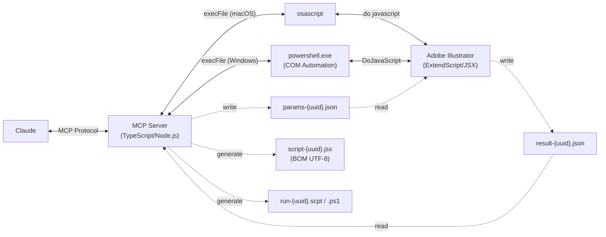

**[English version](README.md)**

# Illustrator MCP Server

[](https://www.npmjs.com/package/illustrator-mcp-server)
[](LICENSE)
[]()
[](https://www.adobe.com/products/illustrator.html)
[](https://modelcontextprotocol.io/)
[](https://ko-fi.com/cyocun)

Adobe Illustrator のデザインデータを読み取り・操作・書き出しする [MCP (Model Context Protocol)](https://modelcontextprotocol.io/) サーバー — 63 のツールを内蔵。

Claude などの AI アシスタントから Illustrator を直接操作し、Web 実装に必要なデザイン情報の取得や、印刷用データの確認・書き出しを行えます。

---

> [!TIP]
> このツールの開発・維持には費用がかかっています。
> 役に立ったらぜひ応援お願いします — [☕ コーヒー奢ってください!](https://ko-fi.com/cyocun)

---

## 🚀 クイックスタート

### 🛠️ Claude Code

[Node.js 20+](https://nodejs.org/) が必要です。

```bash
claude mcp add illustrator-mcp -- npx illustrator-mcp-server
```

### 🖥️ Claude Desktop

1. [GitHub Releases](https://github.com/ie3jp/illustrator-mcp-server/releases/latest) から **`illustrator-mcp-server.mcpb`** をダウンロード
2. Claude Desktop を開き、**設定** → **拡張機能** を開く
3. ダウンロードした `.mcpb` ファイルを拡張機能パネルにドラッグ＆ドロップ
4. **インストール** ボタンをクリック

> [!NOTE]
> `.mcpb` 拡張機能は自動更新されません。更新するには新しいバージョンをダウンロードして再インストールしてください。自動更新が必要な場合は、下記の npx 方式をお使いください。

<details>
<summary><strong>別の方法: 手動設定（npx 経由で常に最新版）</strong></summary>

[Node.js 20+](https://nodejs.org/) が必要です。設定ファイルを開いて、接続情報を書き込みます。

#### 1. 設定ファイルを開く

Claude Desktop のメニューバーから:

**Claude** → **設定** → 左サイドバーの **開発者** → **設定を編集** ボタンをクリック

#### 2. 設定を書き込む

```json
{
  "mcpServers": {
    "illustrator": {
      "command": "npx",
      "args": ["illustrator-mcp-server"]
    }
  }
}
```

> [!NOTE]
> nvm / mise / fnm 等のバージョンマネージャで Node.js をインストールした場合、Claude Desktop が `npx` を見つけられないことがあります。その場合はフルパスを指定してください:
> ```json
> "command": "/フルパス/npx"
> ```
> ターミナルで `which npx` を実行するとパスを確認できます。

#### 3. 保存して再起動

1. ファイルを保存（⌘S）してテキストエディタを閉じる
2. Claude Desktop を **完全に終了**（⌘Q）して再度開く

</details>

> [!CAUTION]
> AI は間違えることがあります。出力を過信せず、**入稿データの最終確認は必ず人間が行ってください**。結果についての責任は利用者にあります。

> [!NOTE]
> **macOS:** 初回実行時にオートメーション権限ダイアログが表示されます。システム設定 > プライバシーとセキュリティ > オートメーション で許可してください。

> [!NOTE]
> 操作系・書き出し系ツールの実行時、Illustrator がフォアグラウンドに切り替わります。

---

## 🎬 こんなことができます

```
あなた: このドキュメントのテキスト情報を全部教えて
Claude:  → list_text_frames → get_text_frame_detail
         ドキュメント内に 12 個のテキストフレームがあります。
         見出し「My Design」はフォント Noto Sans JP Bold 48px、色 #333333 ...
```

```
あなた: 印刷入稿前のチェックをして
Claude:  → preflight_check
         ⚠ 2件の警告:
         - 低解像度画像: image_01.jpg (150dpi) — 300dpi 以上を推奨
         - 非アウトラインフォント: 3 個のテキストフレーム
```

```
あなた: テキストの表記揺れをチェックして
Claude:  → check_text_consistency
         📝 表記揺れレポート:
         ⚠ "お問い合わせ" (2箇所) vs "お問合せ" (1箇所)
         ⚠ "〜" vs "～" — 波ダッシュ vs 全角チルダ
         ❌ "テキストが入ります" (2箇所) — ダミーテキスト残存
```

```
あなた: この A4 チラシからバナーサイズ展開を作って
Claude:  → get_document_info → resize_for_variation
         3 サイズのバリエーションを作成しました:
         - 728×90 / 300×250 / 160×600
```

---

## 📖 使い方レシピ集

<details>
<summary><b>デザインカンプから CSS 用の色・フォント情報を抜き出したい</b></summary>

```
あなた: このデザインの色とフォント情報をまとめて

Claude:  → get_colors → list_text_frames → get_text_frame_detail

         ■ カラーパレット
         - Primary: #1A73E8 (CMYK: 85,50,0,0)
         - Secondary: #34A853
         - Text: #202124
         - Background: #FFFFFF

         ■ フォント
         - 見出し: Noto Sans JP Bold / 32px
         - 本文: Noto Sans JP Regular / 16px / line-height: 1.75
         - キャプション: Noto Sans JP Medium / 12px
```

</details>

<details>
<summary><b>アートボードごとに SVG / PNG を書き出したい</b></summary>

```
あなた: 全アートボードを SVG で書き出して。テキストはアウトライン化して

Claude:  → get_artboards → convert_to_outlines → export (繰り返し)

         4 アートボードを書き出しました:
         - /output/header.svg (アートボード "header")
         - /output/hero.svg (アートボード "hero")
         - /output/feature.svg (アートボード "feature")
         - /output/footer.svg (アートボード "footer")
```

</details>

<details>
<summary><b>入稿データを PDF/X-1a 準拠でチェックしたい</b></summary>

```
あなた: PDF/X-1a で入稿したい。問題ないかチェックして

Claude:  → preflight_check (target_pdf_profile: "x1a")

         ❌ PDF/X-1a 準拠エラー:
         - 透明効果が 3 オブジェクトに存在（X-1a は透明禁止）
         - RGB カラーが 2 箇所に残存（X-1a は CMYK/特色のみ）

         ⚠ 警告:
         - 非アウトラインフォント 5 個（埋め込み推奨）
         - 画像 "photo_02.jpg" が 150dpi（300dpi 以上推奨）
```

</details>

<details>
<summary><b>画像の色空間やスケール率を確認して品質を担保したい</b></summary>

```
あなた: 配置画像の印刷品質をチェックして

Claude:  → get_images (include_print_info: true)

         ■ 画像品質レポート:
         ✅ hero.psd — CMYK, 350dpi, スケール 98%
         ⚠ icon_set.png — RGB (CMYK ドキュメントと不一致), 300dpi, スケール 100%
         ❌ photo_bg.jpg — CMYK, 72dpi, スケール 400% (大幅拡大)
           → 原寸 300dpi 以上の画像に差し替えてください
```

</details>

<details>
<summary><b>テキストと背景のコントラスト比を WCAG 基準でチェックしたい</b></summary>

```
あなた: テキストのコントラスト比をチェックして

Claude:  → check_contrast (auto_detect: true)

         ■ WCAG コントラスト比レポート:
         ❌ "注釈テキスト" on "薄いグレー背景" — 2.8:1 (AA 不適合)
         ⚠ "サブ見出し" on "白背景" — 4.2:1 (AA Large OK, AA Normal NG)
         ✅ "本文テキスト" on "白背景" — 12.1:1 (AAA 適合)
```

</details>

---

## ワークフローテンプレート

Claude Desktop のプロンプト一覧から選択できるワークフローテンプレートです。

| テンプレート | 概要 |
|-------------|------|
| `quick-layout` | テキスト原稿を渡すと、見出し・本文・キャプションを推測してアートボード上にざっくり配置 |
| `print-preflight-workflow` | 印刷入稿前の7ステップ包括チェック（ドキュメント情報→プリフライト→オーバープリント→色分解→画像→カラー→テキスト） |

---

## ツール一覧

### 読み取り系 (21)

<details>
<summary>クリックして展開</summary>

| ツール | 概要 |
|---|---|
| `get_document_info` | ドキュメントのメタデータ（サイズ、カラーモード、プロファイル等） |
| `get_artboards` | アートボード情報（位置、サイズ、向き） |
| `get_layers` | レイヤー構造のツリー取得 |
| `get_document_structure` | レイヤー→グループ→オブジェクトのツリー一括取得 |
| `list_text_frames` | テキストフレーム一覧（フォント、サイズ、スタイル名） |
| `get_text_frame_detail` | 特定テキストの全属性（カーニング、段落設定等） |
| `get_colors` | 使用カラー情報（スウォッチ、グラデーション、スポットカラー等）。`include_diagnostics` で印刷診断 |
| `get_path_items` | パス・シェイプデータ（塗り、線、アンカーポイント） |
| `get_groups` | グループ・クリッピングマスク・複合パスの構造 |
| `get_effects` | エフェクト・アピアランス情報（不透明度、描画モード） |
| `get_images` | 埋め込み/リンク画像の情報（解像度、リンク切れ検出）。`include_print_info` で色空間ミスマッチ・スケール率 |
| `get_symbols` | シンボル定義とインスタンス |
| `get_guidelines` | ガイドライン情報 |
| `get_overprint_info` | オーバープリント設定 + K100/リッチブラック検出・意図判定 |
| `get_separation_info` | 色分解情報（CMYK プロセス版 + スポットカラー版の使用数） |
| `get_selection` | 選択中オブジェクトの詳細 |
| `find_objects` | 条件検索（名前、タイプ、色、フォント等） |
| `check_contrast` | WCAG カラーコントラスト比チェック（手動 or 自動検出） |
| `extract_design_tokens` | デザイントークン抽出（CSS / JSON / Tailwind 形式） |
| `list_fonts` | Illustrator で利用可能なフォント一覧（ドキュメント不要） |
| `convert_coordinate` | アートボード座標系⇔ドキュメント座標系の変換 |

</details>

### 操作系 (37)

<details>
<summary>クリックして展開</summary>

| ツール | 概要 |
|---|---|
| `create_rectangle` | 長方形の作成（角丸対応） |
| `create_ellipse` | 楕円の作成 |
| `create_line` | 直線の作成 |
| `create_text_frame` | テキストフレームの作成（ポイント/エリア） |
| `create_path` | 任意パスの作成（ベジェハンドル対応） |
| `place_image` | 画像ファイルの配置（リンク/埋め込み） |
| `modify_object` | 既存オブジェクトのプロパティ変更 |
| `convert_to_outlines` | テキストのアウトライン化 |
| `assign_color_profile` | カラープロファイルの割り当て（色値の変換は行わない） |
| `create_document` | 新規ドキュメントの作成（サイズ、カラーモード指定） |
| `close_document` | アクティブドキュメントを閉じる |
| `resize_for_variation` | サイズ展開（ソースアートボードから複数サイズを一括生成） |
| `align_objects` | 複数オブジェクトの整列・等間隔分布 |
| `replace_color` | 色の一括検索・置換（許容誤差指定可） |
| `manage_layers` | レイヤーの追加/リネーム/表示/ロック/順序変更/削除 |
| `place_color_chips` | 使用カラーをアートボード外にカラーチップとして配置 |
| `save_document` | ドキュメントの上書き保存・別名保存 |
| `open_document` | ファイルパスからドキュメントを開く |
| `group_objects` | オブジェクトのグループ化（クリッピングマスク対応） |
| `ungroup_objects` | グループの解除 |
| `duplicate_objects` | オブジェクトの複製（オフセット指定可） |
| `set_z_order` | 重なり順の変更（最前面/前面/背面/最背面） |
| `move_to_layer` | オブジェクトを別レイヤーに移動 |
| `manage_artboards` | アートボードの追加・削除・リサイズ・リネーム・整列 |
| `manage_swatches` | スウォッチの追加・更新・削除 |
| `manage_linked_images` | リンク画像の差し替え・埋め込み |
| `manage_datasets` | 変数/データセットの一覧・適用・作成・インポート/エクスポート |
| `apply_graphic_style` | グラフィックスタイルの適用 |
| `list_graphic_styles` | グラフィックスタイル一覧の取得 |
| `apply_text_style` | 文字/段落スタイルの適用 |
| `list_text_styles` | 文字/段落スタイル一覧の取得 |
| `create_gradient` | グラデーションの作成・オブジェクトへの適用 |
| `create_path_text` | パスに沿ったテキストの作成 |
| `place_symbol` | シンボルインスタンスの配置・差し替え |
| `select_objects` | UUID指定でオブジェクトを選択（複数選択対応） |
| `place_style_guide` | アートボード外にビジュアルスタイルガイドを配置（カラー・フォント・スペーシング・マージン・ガイド間隔） |
| `undo` | 操作の取り消し/やり直し（複数ステップ対応） |

</details>

### 書き出し系 (2)

<details>
<summary>クリックして展開</summary>

| ツール | 概要 |
|---|---|
| `export` | SVG / PNG / JPG 書き出し（アートボード、選択範囲、UUID 指定） |
| `export_pdf` | 印刷用 PDF 書き出し（トンボ、裁ち落とし、選択的ダウンサンプリング、出力インテント） |

</details>

### ユーティリティ (3)

<details>
<summary>クリックして展開</summary>

| ツール | 概要 |
|---|---|
| `preflight_check` | 入稿前チェック（RGB 混在、リンク切れ、低解像度、白オーバープリント、透明+オーバープリント相互作用、PDF/X 適合等） |
| `check_text_consistency` | テキスト整合性チェック（ダミーテキスト検出、表記揺れパターン検出、全テキスト一覧） |
| `set_workflow` | ワークフロー設定（Web/Print モード切り替え、座標系デフォルト設定） |

</details>

---

## 既知の制約

| 制約 | 詳細 |
|---|---|
| Windows 対応 | Windows は PowerShell COM を使用（実機未検証） |
| ライブエフェクト | ドロップシャドウ等のエフェクトは存在の検出はできますが、パラメータの取得はできません |
| カラープロファイル | プロファイルの割り当てのみ対応。完全な変換はできません |
| 裁ち落とし設定 | 裁ち落とし設定の読み取りはできません（Illustrator API の制限） |
| WebP 書き出し | 非対応です（PNG / SVG をお使いください） |
| 日本式トンボ | PDF 書き出し時に正しく反映されない場合があります |
| フォント埋め込み | 埋め込み方式（完全/サブセット）の制御はできません。PDF プリセットで設定してください |
| サイズ展開 | 比例縮小のみ。テキストのはみ出し等は手動での調整が必要です |

---

<br>

# 開発者向け情報

## アーキテクチャ



---

## ソースからビルド

```bash
git clone https://github.com/ie3jp/illustrator-mcp-server.git
cd illustrator-mcp-server
npm install
npm run build
claude mcp add illustrator-mcp -- node /path/to/illustrator-mcp-server/dist/index.js
```

### 動作確認

```bash
npx @modelcontextprotocol/inspector npx illustrator-mcp-server
```

### テスト

```bash
# ユニットテスト
npm test

# E2E スモークテスト（Illustrator 起動状態で実行）
npx tsx test/e2e/smoke-test.ts
```

E2E テストは新規ドキュメントを作成し、テストオブジェクトを配置して全 106 ケース（登録済み全ツールカバー）を 6 フェーズで自動実行します。

---

## ライセンス

[MIT](LICENSE)
