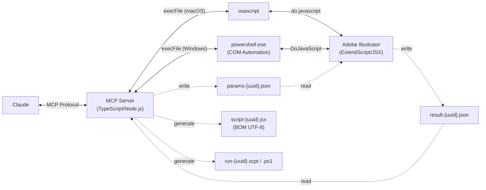

**[English version](README.md)**

# Illustrator MCP Server

[](https://www.npmjs.com/package/illustrator-mcp-server)
[](LICENSE)
[]()
[](https://www.adobe.com/products/illustrator.html)
[](https://modelcontextprotocol.io/)
[](https://buymeacoffee.com/cyocun)

Adobe Illustrator のデザインデータを読み取り・操作・書き出しする [MCP (Model Context Protocol)](https://modelcontextprotocol.io/) サーバー。

Claude などの AI アシスタントから Illustrator を直接操作し、Web 実装に必要なデザイン情報の取得や、印刷用データの確認・書き出しを行えます。

---

## 使用例

**デザインデータの取得:**
```
あなた: このドキュメントのテキスト情報を全部教えて
Claude:  → list_text_frames → get_text_frame_detail を実行
         ドキュメント内に 12 個のテキストフレームがあります。
         見出し「My Design」はフォント Noto Sans JP Bold 48px、色 #333333 ...
```

**SVG 書き出し:**
```
あなた: アートボード「pc」をSVGで書き出して。テキストはアウトライン化して
Claude:  → get_artboards → export を実行
         /path/to/output.svg に書き出しました（テキストアウトライン化済み）
```

**入稿前チェック:**
```
あなた: 印刷入稿前のチェックをして
Claude:  → preflight_check を実行
         ⚠ 2件の警告:
         - 低解像度画像: image_01.jpg (150dpi) — 300dpi 以上を推奨
         - 非アウトラインフォント: 3 個のテキストフレーム
```

**オブジェクト操作:**
```
あなた: 赤い矩形を作って、左上に配置して
Claude:  → create_rectangle を実行
         200×100 の赤い矩形を (0, 0) に作成しました (uuid: abc-123...)
```

---

## 特徴

- **30 ツール** — 読み取り 16 / 操作 11 / 書き出し 2 / ユーティリティ 1
- **Web 座標系** — デフォルトでアートボード相対・Y 軸下向き正（CSS/SVG と同じ座標系）
- **UUID トラッキング** — 全オブジェクトを `pageItem.note` の UUID で一意に識別

---

## 前提条件

| 要件 | バージョン |
|---|---|
| macOS または Windows | macOS: osascript / Windows: PowerShell COM（実機未検証） |
| Adobe Illustrator | CC 2024 以降 |
| Node.js | ビルド済みパッケージの実行は 20 以降 |
| Node.js | ソースからの開発は 24 以降。`vp` と Node の TypeScript 実行フローを前提にしているため |
| Vite+ (`vp`) | `curl -fsSL https://vite.plus | bash` でグローバルに導入し、新しいシェルで `vp help` を確認 |

> **macOS:** 初回実行時にオートメーション権限ダイアログが表示されます。
> システム設定 > プライバシーとセキュリティ > オートメーション で許可してください。

> **Note:** 操作系・書き出し系ツールの実行時、Illustrator がフォアグラウンドに切り替わります。Illustrator はアクティブな状態でないとこれらの処理を実行できないためです。

---

## セットアップ

### Claude Code

```bash
claude mcp add illustrator-mcp -- npx illustrator-mcp-server
```

### Claude Desktop

`claude_desktop_config.json` に追加:
- macOS: `~/Library/Application Support/Claude/claude_desktop_config.json`
- Windows: `%APPDATA%\Claude\claude_desktop_config.json`

```json
{
  "mcpServers": {
    "illustrator": {
      "command": "npx",
      "args": ["illustrator-mcp-server"]
    }
  }
}
```

保存後、Claude Desktop を再起動してください。入力欄にMCPサーバーのインジケーター（ハンマーアイコン）が表示されます。

### ソースから

```bash
git clone https://github.com/ie3jp/illustrator-mcp-server.git
cd illustrator-mcp-server
vp install
vp pack
claude mcp add illustrator-mcp -- node /path/to/illustrator-mcp-server/dist/index.js
```

生成された `dist/` は Node.js 20+ での実行を想定しています。一方、このリポジトリをソースから開発する場合は Node.js 24+ 前提です。

### 動作確認

```bash
npx @modelcontextprotocol/inspector npx illustrator-mcp-server
```

---

## ツール一覧

### 読み取り系 (16)

<details>
<summary>クリックして展開</summary>

| ツール | 概要 |
|---|---|
| `get_document_info` | ドキュメントのメタデータ（サイズ、カラーモード、プロファイル等） |
| `get_artboards` | アートボード情報（位置、サイズ、向き） |
| `get_layers` | レイヤー構造のツリー取得 |
| `get_document_structure` | レイヤー→グループ→オブジェクトのツリー一括取得 |
| `list_text_frames` | テキストフレーム一覧（フォント、サイズ、スタイル名） |
| `get_text_frame_detail` | 特定テキストの全属性（カーニング、段落設定等） |
| `get_colors` | 使用カラー情報（スウォッチ、グラデーション、スポットカラー等） |
| `get_path_items` | パス・シェイプデータ（塗り、線、アンカーポイント） |
| `get_groups` | グループ・クリッピングマスク・複合パスの構造 |
| `get_effects` | エフェクト・アピアランス情報（不透明度、描画モード） |
| `get_images` | 埋め込み/リンク画像の情報（解像度、リンク切れ検出） |
| `get_symbols` | シンボル定義とインスタンス |
| `get_guidelines` | ガイドライン情報 |
| `get_overprint_info` | オーバープリント設定の取得 |
| `get_selection` | 選択中オブジェクトの詳細 |
| `find_objects` | 条件検索（名前、タイプ、色、フォント等） |

</details>

### 操作系 (11)

<details>
<summary>クリックして展開</summary>

| ツール | 概要 |
|---|---|
| `create_rectangle` | 長方形の作成（角丸対応） |
| `create_ellipse` | 楕円の作成 |
| `create_line` | 直線の作成 |
| `create_text_frame` | テキストフレームの作成（ポイント/エリア） |
| `create_path` | 任意パスの作成（ベジェハンドル対応） |
| `place_image` | 画像ファイルの配置（リンク/埋め込み） |
| `modify_object` | 既存オブジェクトのプロパティ変更 |
| `convert_to_outlines` | テキストのアウトライン化 |
| `apply_color_profile` | カラープロファイルの適用 |
| `create_document` | 新規ドキュメントの作成（サイズ、カラーモード指定） |
| `close_document` | アクティブドキュメントを閉じる |

</details>

### 書き出し系 (2)

| ツール | 概要 |
|---|---|
| `export` | SVG / PNG / JPG 書き出し（アートボード、選択範囲、UUID 指定） |
| `export_pdf` | 印刷用 PDF 書き出し（トンボ、裁ち落とし、ダウンサンプリング） |

### ユーティリティ (1)

| ツール | 概要 |
|---|---|
| `preflight_check` | 入稿前チェック（RGB 混在、リンク切れ、低解像度、白オーバープリント等） |

---

## アーキテクチャ



### 座標系

座標を扱う read / modify ツールでは `coordinate_system` パラメータを受け付けます。export やドキュメント全体に対する utility ツールは、座標変換に依存しないため受け付けません。

| 値 | 原点 | Y 軸 | 用途 |
|---|---|---|---|
| `artboard-web`（デフォルト） | アートボード左上 | 下向き正 | Web/CSS 実装 |
| `document` | ペーストボード | 上向き正（Illustrator ネイティブ） | 印刷・DTP |

---

## テスト

```bash
# Lint / format / 型チェック
vp check

# ユニットテスト
vp test run

# パッケージング
vp pack

# Integration check（Illustrator 起動＋ドキュメントを開いた状態）
vp run test:integration

# E2E スモークテスト（Illustrator 起動状態で実行）
vp run test:smoke
```

E2E テストは新規ドキュメントを作成し、テストオブジェクト（図形、テキスト、リンク/埋め込み画像）を配置して全 45 ケースを 5 フェーズで自動実行し、終了後にクリーンアップします。事前のファイル準備は不要です。

---

## 既知の制約

| 制約 | 詳細 |
|---|---|
| macOS / Windows | macOS は osascript、Windows は PowerShell COM を使用（Windows は実機未検証） |
| ライブエフェクト | ExtendScript DOM の制約により、ドロップシャドウ等のパラメータ取得不可 |
| カラープロファイル変換 | プロファイル割り当てのみ。完全な ICC 変換は非対応 |
| 裁ち落とし設定 | ExtendScript API で非公開のため取得不可 |
| WebP 書き出し | ExtendScript の ExportType に存在しないため非対応 |
| 日本式トンボ | `PageMarksTypes.Japanese` が PDF 書き出しで反映されない場合あり |

---

## プロジェクト構成

```
illustrator-mcp-server/
├── src/
│   ├── index.ts              # エントリポイント
│   ├── server.ts             # MCP サーバー
│   ├── executor/
│   │   ├── jsx-runner.ts     # トランスポート選択 + 排他制御
│   │   └── file-transport.ts # 一時ファイル管理 (macOS/Windows)
│   ├── tools/
│   │   ├── registry.ts       # ツール登録
│   │   ├── read/             # 読み取り系 16 ツール
│   │   ├── modify/           # 操作系 11 ツール
│   │   ├── export/           # 書き出し系 2 ツール
│   │   └── utility/          # ユーティリティ 1 ツール
│   ├── utils/
│   │   └── image-header.ts  # 画像フォーマット判定
│   └── jsx/
│       └── helpers/
│           └── common.jsx    # ExtendScript 共通ヘルパー
├── test/
│   ├── unit/                 # ユニットテスト
│   └── e2e/
│       └── smoke-test.ts     # E2E スモークテスト
└── docs/                     # 設計ドキュメント
```

---

## サポート

役に立ったら[ビール奢ってください 🍺](https://buymeacoffee.com/cyocun)

---

## ライセンス

[MIT](LICENSE)
