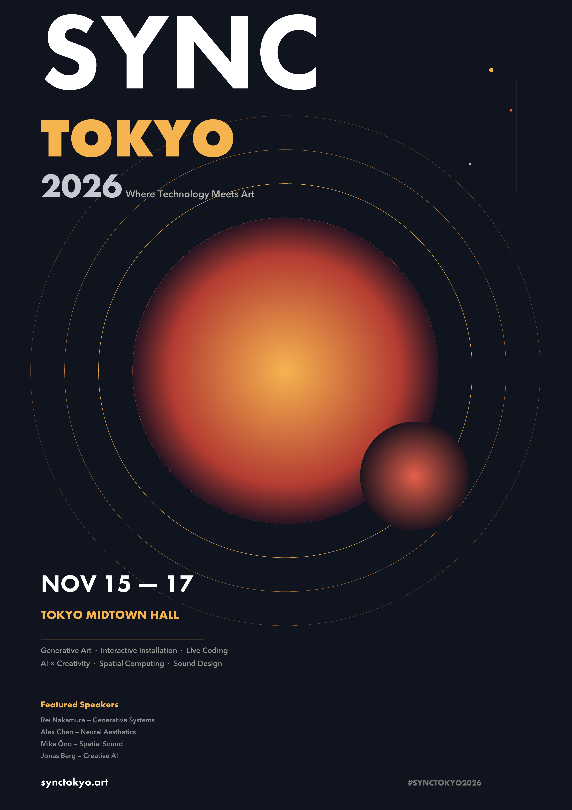
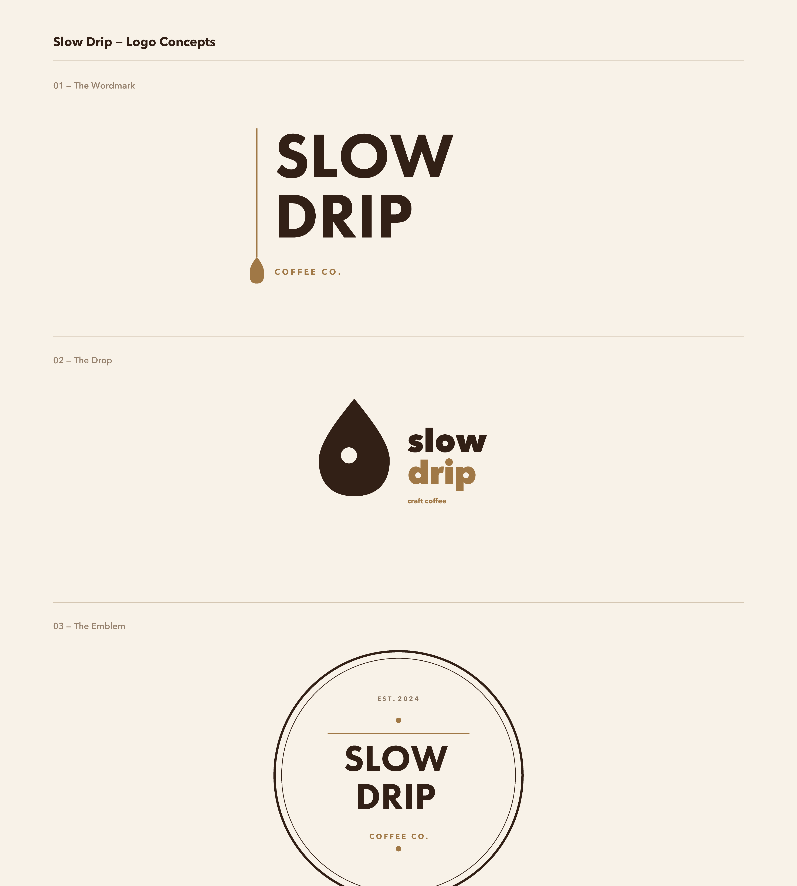
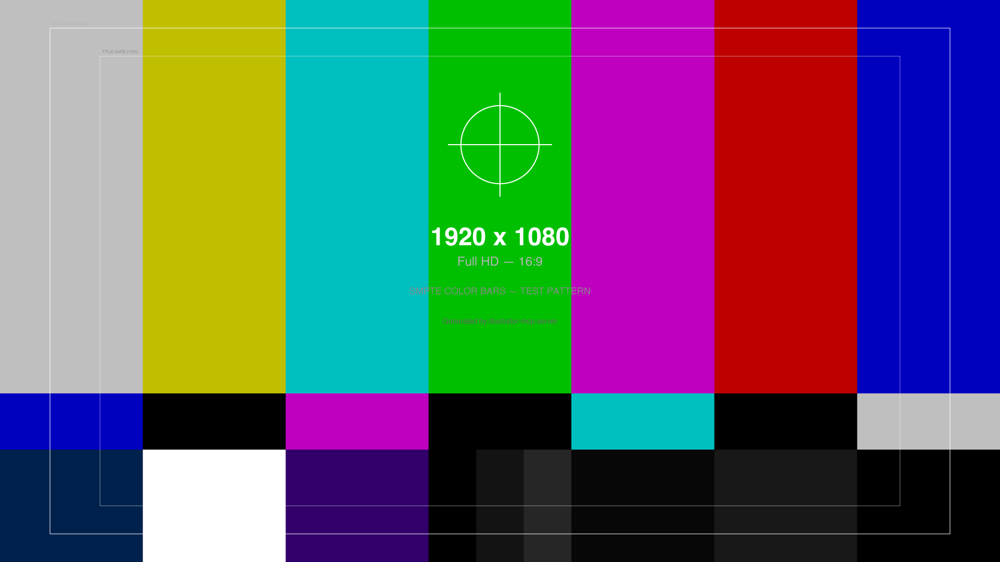
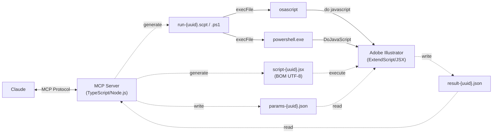

[🇺🇸 English](README.md) | [🇯🇵 日本語](README.ja.md) | [🇨🇳 简体中文](README.zh-CN.md) | **🇰🇷 한국어** | [🇪🇸 Español](README.es.md) | [🇩🇪 Deutsch](README.de.md) | [🇫🇷 Français](README.fr.md) | [🇵🇹 Português (BR)](README.pt-BR.md)

# Illustrator MCP Server

[](https://www.npmjs.com/package/illustrator-mcp-server)
[](LICENSE)
[]()
[](https://www.adobe.com/products/illustrator.html)
[](https://modelcontextprotocol.io/)
[](https://ko-fi.com/cyocun)

Adobe Illustrator의 디자인 데이터를 읽고, 조작하고, 내보내기 위한 [MCP (Model Context Protocol)](https://modelcontextprotocol.io/) 서버 — 63개의 내장 도구 제공.

Claude와 같은 AI 어시스턴트에서 Illustrator를 직접 제어 — 웹 구현을 위한 디자인 정보 추출, 인쇄 납품용 데이터 검증, 에셋 내보내기까지.

[](https://glama.ai/mcp/servers/ie3jp/illustrator-mcp-server)

---

## 🎨 갤러리

아래의 모든 아트워크는 Claude가 자연어 대화만으로 전부 제작했습니다 — Illustrator의 수동 조작은 일체 없었습니다.

<table>
<tr>
<td align="center"><br><b>이벤트 포스터</b></td>
<td align="center"><br><b>로고 컨셉</b></td>
</tr>
<tr>
<td align="center"><br><b>명함</b></td>
<td align="center"><br><b>Twilight Geometry</b></td>
</tr>
</table>

> 프롬프트, 도구 사용, 아트보드 구성에 대한 [자세한 분석](#예시-smpte-테스트-패턴)은 아래를 참고하세요.

---

> [!TIP]
> 이 도구를 개발하고 유지관리하는 데는 시간과 리소스가 필요합니다.
> 여러분의 워크플로우에 도움이 된다면, 후원은 큰 힘이 됩니다 — [☕ 커피 한 잔 사주기!](https://ko-fi.com/cyocun)

---

## 🚀 빠른 시작

### 🛠️ Claude Code

[Node.js 20+](https://nodejs.org/)가 필요합니다.

```bash
claude mcp add illustrator-mcp -- npx illustrator-mcp-server
```

### 🖥️ Claude Desktop

1. [GitHub Releases](https://github.com/ie3jp/illustrator-mcp-server/releases/latest)에서 **`illustrator-mcp-server.mcpb`** 를 다운로드
2. Claude Desktop 열기 → **Settings** → **Extensions**
3. `.mcpb` 파일을 Extensions 패널에 드래그 앤 드롭
4. **Install** 버튼 클릭

<details>
<summary><strong>대안: 수동 설정 (npx를 통해 항상 최신 상태 유지)</strong></summary>

> [!NOTE]
> `.mcpb` 확장은 자동 업데이트되지 않습니다. 업데이트하려면 새 버전을 다운로드하여 재설치하세요. 자동 업데이트를 선호한다면 아래의 npx 방식을 대신 사용하세요.

[Node.js 20+](https://nodejs.org/)가 필요합니다. 설정 파일을 열고 연결 설정을 추가하세요.

#### 1. 설정 파일 열기

Claude Desktop 메뉴 바에서:

**Claude** → **Settings...** → **Developer** (좌측 사이드바) → **Edit Config** 버튼 클릭

#### 2. 설정 추가

```json
{
  "mcpServers": {
    "illustrator": {
      "command": "npx",
      "args": ["illustrator-mcp-server"]
    }
  }
}
```

> [!NOTE]
> 버전 관리자(nvm, mise, fnm 등)로 Node.js를 설치한 경우, Claude Desktop이 `npx`를 찾지 못할 수 있습니다. 이 경우 전체 경로를 사용하세요:
> ```json
> "command": "/full/path/to/npx"
> ```
> 터미널에서 `which npx`를 실행하여 경로를 확인하세요.

#### 3. 저장 및 재시작

1. 파일을 저장하고 텍스트 에디터를 닫습니다
2. Claude Desktop을 **완전히 종료**(⌘Q / Ctrl+Q)한 후 다시 엽니다

</details>

> [!CAUTION]
> AI는 실수할 수 있습니다. 출력에 과도하게 의존하지 말고 — **납품 데이터는 반드시 사람이 최종 확인해야 합니다**. 결과에 대한 책임은 사용자에게 있습니다.

> [!NOTE]
> **macOS:** 처음 실행 시, 시스템 설정 > 개인정보 보호 및 보안 > 자동화에서 자동화 접근 권한을 허용하세요.

> [!NOTE]
> 수정 및 내보내기 도구는 실행 중에 Illustrator를 전면으로 가져옵니다.

### 여러 Illustrator 버전

여러 버전의 Illustrator가 설치되어 있는 경우, 대화 중에 어떤 버전을 사용할지 Claude에게 알려줄 수 있습니다. "Illustrator 2024를 사용해" 같은 식으로 말하면 `set_illustrator_version` 도구가 해당 버전을 대상으로 합니다.

> [!NOTE]
> Illustrator가 이미 실행 중인 경우, 버전 설정과 관계없이 서버는 실행 중인 인스턴스에 연결됩니다. 이 버전 설정은 Illustrator가 아직 실행되지 않은 상태에서 올바른 버전을 실행하기 위해서만 사용됩니다.

---

## 🎬 할 수 있는 것들

```
당신:   이 문서의 모든 텍스트 정보를 보여줘
Claude:  → list_text_frames → get_text_frame_detail
         문서에 12개의 텍스트 프레임이 있습니다.
         헤딩 "My Design"은 Noto Sans JP Bold 48px, 컬러 #333333 사용 중...
```

```
당신:   인쇄 전 프리플라이트 체크를 실행해줘
Claude:  → preflight_check
         ⚠ 경고 2건:
         - 저해상도 이미지: image_01.jpg (150dpi) — 300dpi 이상 권장
         - 윤곽선화되지 않은 폰트: 텍스트 프레임 3건
```

```
당신:   텍스트 일관성을 확인해줘
Claude:  → check_text_consistency
         📝 일관성 리포트:
         ⚠ "Contact Us" vs "Contact us" — 대소문자 불일치
         ❌ "Lorem ipsum" (2군데) — 자리표시 텍스트 잔존
```

```
당신:   이 A4 전단지로부터 배너 사이즈 바리에이션을 만들어줘
Claude:  → get_document_info → resize_for_variation
         3개의 사이즈 바리에이션을 생성했습니다:
         - 728×90 / 300×250 / 160×600
```

---

## 📖 레시피

<details>
<summary><b>CSS용 컬러와 폰트 추출</b></summary>

```
당신:   이 디자인의 컬러와 타이포그래피를 요약해줘

Claude:  → get_colors → list_text_frames → get_text_frame_detail

         ■ 컬러 팔레트
         - Primary: #1A73E8 (CMYK: 85,50,0,0)
         - Secondary: #34A853
         - Text: #202124
         - Background: #FFFFFF

         ■ 타이포그래피
         - 헤딩: Noto Sans JP Bold / 32px
         - 본문: Noto Sans JP Regular / 16px / line-height: 1.75
         - 캡션: Noto Sans JP Medium / 12px
```

</details>

<details>
<summary><b>아트보드를 SVG / PNG로 내보내기</b></summary>

```
당신:   모든 아트보드를 텍스트 윤곽선화하여 SVG로 내보내줘

Claude:  → get_artboards → convert_to_outlines → export (반복)

         4개의 아트보드를 내보냈습니다:
         - /output/header.svg
         - /output/hero.svg
         - /output/feature.svg
         - /output/footer.svg
```

</details>

<details>
<summary><b>납품 전 PDF/X-1a 준수 여부 확인</b></summary>

```
당신:   이 문서가 PDF/X-1a를 준수하는지 확인해줘

Claude:  → preflight_check (target_pdf_profile: "x1a")

         ❌ PDF/X-1a 준수 오류:
         - 객체 3개에 투명도 사용 (X-1a는 투명도 금지)
         - RGB 컬러 2군데 발견 (X-1a는 CMYK/별색만 허용)

         ⚠ 경고:
         - 윤곽선화되지 않은 폰트 5개 (임베드 권장)
         - 이미지 "photo_02.jpg" 150dpi (300dpi 권장)
```

</details>

<details>
<summary><b>인쇄용 이미지 품질 체크</b></summary>

```
당신:   배치된 이미지의 인쇄 품질을 확인해줘

Claude:  → get_images (include_print_info: true)

         ■ 이미지 품질 리포트:
         ✅ hero.psd — CMYK, 350dpi, 배율 98%
         ⚠ icon_set.png — RGB (CMYK 문서와 불일치), 300dpi, 배율 100%
         ❌ photo_bg.jpg — CMYK, 72dpi, 배율 400% (과도한 확대)
           → 실제 크기 기준 300dpi 이상의 이미지로 교체 필요
```

</details>

<details>
<summary><b>WCAG 컬러 대비율 체크</b></summary>

```
당신:   텍스트 대비율을 확인해줘

Claude:  → check_contrast (auto_detect: true)

         ■ WCAG 대비율 리포트:
         ❌ "Caption" on "light gray" — 2.8:1 (AA 불합격)
         ⚠ "Subheading" on "white" — 4.2:1 (AA Large 합격, AA Normal 불합격)
         ✅ "Body text" on "white" — 12.1:1 (AAA 합격)
```

</details>

---

## 워크플로우 템플릿

Claude Desktop의 프롬프트 피커에서 사용할 수 있는 사전 구축된 워크플로우 템플릿입니다.

| 템플릿 | 설명 |
|----------|-------------|
| `quick-layout` | 텍스트 콘텐츠를 붙여넣으면 Claude가 아트보드 위에 헤딩, 본문, 캡션으로 배치합니다 |
| `print-preflight-workflow` | 포괄적인 7단계 인쇄 전 체크 (문서 → 프리플라이트 → 오버프린트 → 색분리 → 이미지 → 컬러 → 텍스트) |

---

## 도구 레퍼런스

### 읽기 도구 (21)

<details>
<summary>클릭하여 펼치기</summary>

| 도구 | 설명 |
|---|---|
| `get_document_info` | 문서 메타데이터 (크기, 컬러 모드, 프로파일 등) |
| `get_artboards` | 아트보드 정보 (위치, 크기, 방향) |
| `get_layers` | 레이어 구조를 트리 형태로 반환 |
| `get_document_structure` | 전체 트리: 레이어 → 그룹 → 객체를 한 번의 호출로 |
| `list_text_frames` | 텍스트 프레임 목록 (폰트, 크기, 스타일명) |
| `get_text_frame_detail` | 특정 텍스트 프레임의 모든 속성 (커닝, 단락 설정 등) |
| `get_colors` | 사용 중인 컬러 정보 (스와치, 그라디언트, 별색). `include_diagnostics`로 인쇄 분석 가능 |
| `get_path_items` | 패스/셰이프 데이터 (채우기, 선, 고정점) |
| `get_groups` | 그룹, 클리핑 마스크, 컴파운드 패스 구조 |
| `get_effects` | 효과 및 어피어런스 정보 (불투명도, 블렌드 모드) |
| `get_images` | 임베디드/링크 이미지 정보 (해상도, 링크 끊김 감지). `include_print_info`로 색공간 불일치 및 배율 확인 |
| `get_symbols` | 심볼 정의 및 인스턴스 |
| `get_guidelines` | 가이드 정보 |
| `get_overprint_info` | 오버프린트 설정 + K100/리치 블랙 감지 및 의도 분류 |
| `get_separation_info` | 색분리 정보 (CMYK 프로세스 판 + 사용 횟수가 포함된 별색 판) |
| `get_selection` | 현재 선택된 객체의 상세 정보 |
| `find_objects` | 조건으로 검색 (이름, 타입, 컬러, 폰트 등) |
| `check_contrast` | WCAG 컬러 대비율 체크 (수동 또는 겹치는 쌍 자동 감지) |
| `extract_design_tokens` | 디자인 토큰을 CSS 커스텀 속성, JSON, Tailwind 설정으로 추출 |
| `list_fonts` | Illustrator에서 사용 가능한 폰트 목록 (문서 불필요) |
| `convert_coordinate` | 아트보드와 문서 좌표계 사이의 좌표 변환 |

</details>

### 수정 도구 (38)

<details>
<summary>클릭하여 펼치기</summary>

| 도구 | 설명 |
|---|---|
| `create_rectangle` | 사각형 생성 (둥근 모서리 지원) |
| `create_ellipse` | 타원 생성 |
| `create_line` | 선 생성 |
| `create_text_frame` | 텍스트 프레임 생성 (포인트 또는 영역 타입) |
| `create_path` | 커스텀 패스 생성 (베지어 핸들 포함) |
| `place_image` | 이미지 파일을 링크 또는 임베드로 배치 |
| `modify_object` | 기존 객체의 속성 수정 |
| `convert_to_outlines` | 텍스트를 윤곽선화 |
| `assign_color_profile` | 컬러 프로파일 지정(태그) (컬러 값은 변환하지 않음) |
| `create_document` | 새 문서 생성 (크기, 컬러 모드) |
| `close_document` | 활성 문서 닫기 |
| `resize_for_variation` | 소스 아트보드에서 사이즈 바리에이션 생성 (비례 스케일링) |
| `align_objects` | 여러 객체의 정렬 및 분포 |
| `replace_color` | 문서 전체에서 컬러를 찾아 치환 (허용 오차 포함) |
| `manage_layers` | 레이어 추가, 이름 변경, 표시/숨기기, 잠금/해제, 순서 변경, 삭제 |
| `place_color_chips` | 고유 컬러를 추출하여 아트보드 외부에 컬러 칩 스와치 배치 |
| `save_document` | 활성 문서 저장 또는 다른 이름으로 저장 |
| `open_document` | 파일 경로로부터 문서 열기 |
| `group_objects` | 객체 그룹화 (클리핑 마스크 지원) |
| `ungroup_objects` | 그룹 해제 및 자식 요소 분리 |
| `duplicate_objects` | 객체 복제 (오프셋 옵션 포함) |
| `set_z_order` | 겹침 순서 변경 (앞/뒤) |
| `move_to_layer` | 객체를 다른 레이어로 이동 |
| `manage_artboards` | 아트보드 추가, 제거, 크기 조정, 이름 변경, 재배치 |
| `manage_swatches` | 스와치 추가, 업데이트, 삭제 |
| `manage_linked_images` | 배치된 이미지의 재링크 또는 임베드 |
| `manage_datasets` | 데이터셋 목록/적용/생성, 변수 가져오기/내보내기 |
| `apply_graphic_style` | 객체에 그래픽 스타일 적용 |
| `list_graphic_styles` | 문서 내 모든 그래픽 스타일 목록 |
| `apply_text_style` | 텍스트에 문자 또는 단락 스타일 적용 |
| `list_text_styles` | 모든 문자 및 단락 스타일 목록 |
| `create_gradient` | 그라디언트 생성 및 객체에 적용 |
| `create_path_text` | 패스를 따르는 텍스트 생성 |
| `place_symbol` | 심볼 인스턴스 배치 또는 교체 |
| `select_objects` | UUID로 객체 선택 (다중 선택 지원) |
| `create_crop_marks` | 로케일 기반 스타일 자동 감지로 재단선(크롭 마크) 생성 (일본식 더블 라인 / 서양식 싱글 라인) |
| `place_style_guide` | 비주얼 스타일 가이드를 아트보드 외부에 배치 (컬러, 폰트, 간격, 여백, 가이드 간격) |
| `undo` | 실행 취소/재실행 (여러 단계) |

</details>

### 내보내기 도구 (2)

<details>
<summary>클릭하여 펼치기</summary>

| 도구 | 설명 |
|---|---|
| `export` | SVG / PNG / JPG 내보내기 (아트보드, 선택, 또는 UUID 단위) |
| `export_pdf` | 인쇄 납품용 PDF 내보내기 (재단선, 도련, 선택적 다운샘플링, 출력 인텐트) |

</details>

### 유틸리티 (3)

<details>
<summary>클릭하여 펼치기</summary>

| 도구 | 설명 |
|---|---|
| `preflight_check` | 인쇄 전 체크 (RGB 혼재, 링크 끊김, 저해상도, 흰색 오버프린트, 투명도+오버프린트 상호작용, PDF/X 준수 등) |
| `check_text_consistency` | 텍스트 일관성 체크 (자리표시 감지, 표기 편차 패턴, LLM 분석용 전체 텍스트 리스팅) |
| `set_workflow` | 워크플로우 모드 설정 (web/print)으로 자동 감지된 좌표계 재정의 |

</details>

---

## 좌표계

서버는 문서로부터 좌표계를 자동으로 감지합니다:

| 문서 유형 | 좌표계 | 원점 | Y축 |
|---|---|---|---|
| CMYK / 인쇄 | `document` | 좌하단 | 위로 |
| RGB / 웹 | `artboard-web` | 아트보드 좌상단 | 아래로 |

- **CMYK 문서**는 Illustrator의 네이티브 좌표계를 사용하며, 인쇄 디자이너의 기대와 일치합니다
- **RGB 문서**는 AI가 다루기 쉬운 웹 스타일 좌표계를 사용합니다
- 필요하면 `set_workflow`로 자동 감지된 좌표계를 재정의할 수 있습니다
- 모든 도구 응답에는 활성 좌표계를 나타내는 `coordinateSystem` 필드가 포함됩니다

---

## 예시: SMPTE 테스트 패턴

1920×1080 SMPTE 컬러 바 테스트 패턴 — Claude에게 자연어로 지시하여 전부 제작되었습니다.

**프롬프트:**

> Make a 1920x1080 video test pattern

**결과:**



**아트보드 구조** (`get_document_structure`로 확인):

<details>
<summary>클릭하여 펼치기</summary>

```
Labels
├── title-safe-label        (text)    — "TITLE SAFE (10%)"
├── action-safe-label       (text)    — "ACTION SAFE (5%)"
├── credit-label            (text)    — "Generated by illustrator-mcp-server"
├── test-label              (text)    — "SMPTE COLOR BARS — TEST PATTERN"
├── format-label            (text)    — "Full HD — 16:9"
└── resolution-label        (text)    — "1920 x 1080"

Center Cross
├── title-safe              (path)    — 1536×864 stroke rectangle
├── action-safe             (path)    — 1728×972 stroke rectangle
├── cross-circle            (path)    — 150×150 center circle
├── cross-v                 (path)    — vertical crosshair
└── cross-h                 (path)    — horizontal crosshair

Color Bars
├── pluge-black … pluge-navy   (path ×9)  — PLUGE / grayscale bottom strip
├── rev-white … rev-blue       (path ×7)  — reverse color middle strip
└── bar-white … bar-blue       (path ×7)  — 75% SMPTE color bars
```

</details>

> 사용된 도구: `create_document`, `manage_layers`, `create_rectangle` ×23, `create_line` ×2, `create_ellipse`, `create_text_frame` ×6, `modify_object` ×4, `save_document`, `export`

---

## 예시: Twilight Geometry

추상적인 기하학적 풍경 아트워크 — "원하는 아트를 만들어줘"라는 지시 외에 사람의 디자인 디렉션 없이 Claude가 전부 제작했습니다.

**프롬프트:**

> Make an art piece of your own imagination in Illustrator. Take your time. Create whatever you like.

**Claude의 과정:**

> "Twilight Geometry"를 만들어보겠습니다 — 기하학적인 천체 요소가 있는 추상적인 풍경. 깊이감 있는 그라디언트 황혼 하늘, 레이어드된 산 실루엣, 장식적인 링이 있는 초승달, 그리고 캔버스 전체에 흩뿌려진 별들.

> 다양한 색상의 다이아몬드 모양 별들 — 따뜻한 화이트, 차가운 블루, 라벤더 퍼플 — 각각이 미묘하게 달라 서로 다른 종류의 별을 암시합니다. 이들을 잇는 별자리 라인. 신비로운 분위기를 위해 하늘에 떠 있는 와이어프레임 삼각형과 육각형.

> 하단에는 수면이 있고 달빛이 일렁이는 물결선으로 반사되어, 아래로 내려갈수록 사라집니다.

**Claude의 소감:**

> 기대보다 더 잘 나왔습니다. 기하학과 자연이 혼재된 세계가 잘 표현되었다고 생각합니다.

**결과:**


> 사용된 도구: `create_document`, `manage_layers` ×4, `create_rectangle` ×2, `create_gradient` ×2, `create_path` ×11, `create_ellipse` ×14, `create_line` ×4, `create_text_frame` ×2, `modify_object`, `set_z_order`, `export`

---

## 알려진 제약사항

| 제약사항 | 상세 |
|---|---|
| Windows 지원 | Windows는 PowerShell COM 자동화를 사용 (실제 하드웨어에서 아직 테스트되지 않음) |
| 라이브 이펙트 | 드롭 섀도우 등 이펙트 파라미터는 감지 가능하지만 읽을 수는 없음 |
| 컬러 프로파일 | 컬러 프로파일 지정만 가능 — 완전한 변환은 미지원 |
| 도련(Bleed) 설정 | 도련 설정은 읽을 수 없음 (Illustrator API 제한) |
| WebP 내보내기 | 미지원 — PNG 또는 SVG를 대신 사용 |
| 일본식 재단선 | PDF 내보내기는 자동으로 TrimMark 명령 방식을 사용: 마크를 문서 패스로 생성하고, 내보낸 후 undo로 제거 |
| 폰트 임베딩 | 임베딩 모드(full/subset)를 직접 제어 불가 — PDF 프리셋을 사용 |
| 사이즈 바리에이션 | 비례 스케일링만 지원 — 텍스트는 이후 수동 조정이 필요할 수 있음 |

---

<br>

# 개발자용

## 아키텍처



---

## 소스에서 빌드하기

```bash
git clone https://github.com/ie3jp/illustrator-mcp-server.git
cd illustrator-mcp-server
npm install
npm run build
claude mcp add illustrator-mcp -- node /path/to/illustrator-mcp-server/dist/index.js
```

### 검증

```bash
npx @modelcontextprotocol/inspector npx illustrator-mcp-server
```

### 테스트

```bash
# 유닛 테스트
npm test

# E2E 스모크 테스트 (Illustrator 실행 필요)
npx tsx test/e2e/smoke-test.ts
```

E2E 테스트는 새 문서(RGB + CMYK)를 생성하고, 테스트 객체를 배치하며, 등록된 모든 도구와 좌표계 자동 감지를 아우르는 10단계에 걸친 182개의 테스트 케이스를 실행한 후, 자동으로 정리합니다.

---

## 면책 조항

이 도구는 많은 Illustrator 작업을 자동화하지만, AI는 실수할 수 있습니다. 추출된 데이터, 프리플라이트 결과, 문서 수정은 항상 사람이 검토해야 합니다. **이 도구를 유일한 품질 점검 수단으로 의존하지 마세요.** 본인의 수동 검증과 병행하는 보조 도구로 사용하되, 특히 인쇄 납품 및 클라이언트 전달 데이터에서는 주의하세요. 저자는 본 소프트웨어 또는 그 출력 사용으로 인한 어떠한 손해나 손실에 대해서도 책임지지 않습니다.

---

## 라이선스

[MIT](LICENSE)
