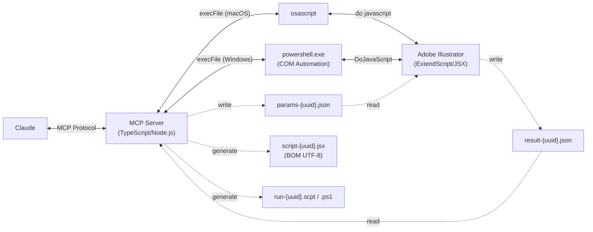

> **⚠️ Caution:** AI can make mistakes. Do not over-rely on the output — **always have a human perform the final check on submission data**. The user is responsible for the results.

**[日本語版はこちら / Japanese version](README.ja.md)**

# Illustrator MCP Server

[](https://www.npmjs.com/package/illustrator-mcp-server)
[](LICENSE)
[]()
[](https://www.adobe.com/products/illustrator.html)
[](https://modelcontextprotocol.io/)
[](https://ko-fi.com/cyocun)

An [MCP (Model Context Protocol)](https://modelcontextprotocol.io/) server for reading, manipulating, and exporting Adobe Illustrator design data.

Control Illustrator directly from AI assistants like Claude — extract design information for web implementation, verify print-ready data, and export assets.

[](https://glama.ai/mcp/servers/ie3jp/illustrator-mcp-server)

---

## Quick Start

**Requirements:** macOS or Windows / Adobe Illustrator CC 2024+ / [Node.js 20+](https://nodejs.org/)

<details>
<summary><strong>How to install Node.js (first-time setup)</strong></summary>

Node.js is a runtime required to run this tool.
Skip this section if you already have it installed.

1. Go to [nodejs.org](https://nodejs.org/)
2. Click the **green "LTS" button** to download
3. Open the downloaded file and follow the installer instructions

To verify the installation, open Terminal (macOS) or Command Prompt (Windows) and type:

```bash
node -v
```

If you see a version number like `v20.x.x`, you're all set.

</details>

### Claude Code

```bash
claude mcp add illustrator-mcp -- npx illustrator-mcp-server
```

### Claude Desktop

1. Download **`illustrator-mcp-server-x.x.x.mcpb`** from [GitHub Releases](https://github.com/ie3jp/illustrator-mcp-server/releases/latest)
2. Open Claude Desktop → **Settings** → **Extensions**
3. Drag and drop the `.mcpb` file into the Extensions panel
4. Click the **Install** button

> **Updating:** The `.mcpb` extension does not auto-update. To update, download the new version and reinstall. If you prefer automatic updates, use the npx method below instead.

<details>
<summary><strong>Alternative: manual config (always up to date via npx)</strong></summary>

Open the config file and add the connection settings.

#### 1. Open the config file

From the Claude Desktop menu bar:

**Claude** → **Settings...** → **Developer** (in the left sidebar) → Click the **Edit Config** button

#### 2. Add the settings

```json
{
  "mcpServers": {
    "illustrator": {
      "command": "npx",
      "args": ["illustrator-mcp-server"]
    }
  }
}
```

> **Note:** If you installed Node.js via a version manager (nvm, mise, fnm, etc.), Claude Desktop may not find `npx`. In that case, use the full path:
> ```json
> "command": "/full/path/to/npx"
> ```
> Run `which npx` in your terminal to find the path.

#### 3. Save and restart

1. Save the file and close the text editor
2. **Fully quit** Claude Desktop (⌘Q / Ctrl+Q) and reopen it

</details>

> **macOS:** On first run, allow automation access in System Settings > Privacy & Security > Automation.

> **Note:** Modify and export tools will bring Illustrator to the foreground during execution.

---

## What You Can Do

```
You:    Show me all the text information in this document
Claude:  → list_text_frames → get_text_frame_detail
         There are 12 text frames in the document.
         The heading "My Design" uses Noto Sans JP Bold 48px, color #333333 ...
```

```
You:    Run a pre-press preflight check
Claude:  → preflight_check
         ⚠ 2 warnings:
         - Low resolution image: image_01.jpg (150dpi) — 300dpi or higher recommended
         - Non-outlined fonts: 3 text frames
```

```
You:    Check text for inconsistencies
Claude:  → check_text_consistency
         📝 Consistency Report:
         ⚠ "Contact Us" vs "Contact us" — capitalization mismatch
         ❌ "Lorem ipsum" (2 places) — placeholder text remaining
```

```
You:    Create banner size variations from this A4 flyer
Claude:  → get_document_info → resize_for_variation
         Created 3 size variations:
         - 728×90 / 300×250 / 160×600
```

---

## Recipes

### Web Implementation

<details>
<summary><b>Extract colors and fonts for CSS</b></summary>

```
You:    Summarize the colors and typography in this design

Claude:  → get_colors → list_text_frames → get_text_frame_detail

         ■ Color Palette
         - Primary: #1A73E8 (CMYK: 85,50,0,0)
         - Secondary: #34A853
         - Text: #202124
         - Background: #FFFFFF

         ■ Typography
         - Headings: Noto Sans JP Bold / 32px
         - Body: Noto Sans JP Regular / 16px / line-height: 1.75
         - Captions: Noto Sans JP Medium / 12px
```

</details>

<details>
<summary><b>Export artboards as SVG / PNG</b></summary>

```
You:    Export all artboards as SVG with outlined text

Claude:  → get_artboards → convert_to_outlines → export (repeated)

         Exported 4 artboards:
         - /output/header.svg
         - /output/hero.svg
         - /output/feature.svg
         - /output/footer.svg
```

</details>

<details>
<summary><b>Inspect a specific object's styling</b></summary>

```
You:    Tell me about the "CTA Button" object

Claude:  → find_objects (name: "CTA Button") → get_path_items → get_effects

         ■ CTA Button (uuid: abc-123)
         - Size: 200×48px
         - Corner radius: 24px
         - Fill: #1A73E8
         - Stroke: none
         - Opacity: 100%
         - Drop shadow: present (parameters not readable due to API limitation)
```

</details>

### Print & Pre-press

<details>
<summary><b>Check PDF/X-1a compliance before submission</b></summary>

```
You:    Check if this document is PDF/X-1a compliant

Claude:  → preflight_check (target_pdf_profile: "x1a")

         ❌ PDF/X-1a compliance errors:
         - Transparency on 3 objects (X-1a prohibits transparency)
         - RGB colors found in 2 places (X-1a requires CMYK/spot only)

         ⚠ Warnings:
         - 5 non-outlined fonts (embedding recommended)
         - Image "photo_02.jpg" at 150dpi (300dpi recommended)
```

</details>

<details>
<summary><b>Audit overprint settings to prevent print accidents</b></summary>

```
You:    Check overprint settings

Claude:  → get_overprint_info

         ■ 4 objects with overprint

         ✅ Safe (K100 overprint — intentional):
         - "Headline" text (K100, ink coverage 100%)
         - "Rule line" path (K100, ink coverage 100%)

         ⚠ Review needed (possibly accidental):
         - "Background decoration" (C30 M80 Y0 K0, coverage 110%)
         - "Rich black frame" (C40 M40 Y40 K100, coverage 320%)
           → Rich black + overprint can cause unexpected color bleed
```

</details>

<details>
<summary><b>Check color separations</b></summary>

```
You:    Show me the color separation info

Claude:  → get_separation_info

         ■ Separations (CMYK document)
         - Cyan: 342 uses
         - Magenta: 287 uses
         - Yellow: 301 uses
         - Black: 456 uses
         - DIC 2585 (spot): 12 uses
           → This will output as 5 plates.
```

</details>

<details>
<summary><b>Export PDF with crop marks and bleed</b></summary>

```
You:    Export PDF with Japanese crop marks and 3mm bleed

Claude:  → export_pdf (trim_marks: true, marks_style: "japanese", bleed: true)

         Exported to /output/print_ready.pdf
         - Japanese crop marks (0.125pt)
         - 3mm bleed
         - Registration marks auto-applied
```

</details>

<details>
<summary><b>Check image quality for print</b></summary>

```
You:    Check placed image quality for print

Claude:  → get_images (include_print_info: true)

         ■ Image Quality Report:
         ✅ hero.psd — CMYK, 350dpi, scale 98%
         ⚠ icon_set.png — RGB (mismatch with CMYK document), 300dpi, scale 100%
         ❌ photo_bg.jpg — CMYK, 72dpi, scale 400% (over-enlarged)
           → Replace with a 300dpi+ image at actual size
```

</details>

### Text Proofing

<details>
<summary><b>Find placeholder text and notation inconsistencies</b></summary>

```
You:    Check text for inconsistencies

Claude:  → check_text_consistency

         📝 Consistency Report:

         ■ Notation variations
         ⚠ "Contact Us" (2 places) vs "Contact us" (1 place)
         ⚠ "e-mail" (1 place) vs "email" (3 places) vs "E-mail" (1 place)

         ■ Possible outdated content
         ❌ Header still says "2024" (all other instances are "2025")
         ❌ Footer phone number differs from other pages

         ■ Placeholder text
         ❌ "Lorem ipsum" (2 places) — forgotten placeholder?
         ❌ "Sample text" (1 place)
```

</details>

### Design Variations

<details>
<summary><b>Create multiple banner sizes from a single design</b></summary>

```
You:    Create 3 web banner sizes from this A4 flyer

Claude:  → get_document_info → resize_for_variation (3 targets)

         Created 3 variations:
         - "Leaderboard" artboard (728×90pt, scaled to 11%)
         - "Medium Rectangle" artboard (300×250pt, scaled to 30%)
         - "Wide Skyscraper" artboard (160×600pt, scaled to 71%)

         ⚠ Text reflow is not applied.
           You may need to adjust text sizing and overflow manually.
```

</details>

<details>
<summary><b>Build a layout with shapes and text</b></summary>

```
You:    Create a business card layout with company name, name, email, and phone

Claude:  → create_document (91×55mm, CMYK)
         → create_text_frame × 4
         → create_rectangle (background)
         → create_line (divider)

         Business card layout created:
         - Company: top center / Noto Sans JP Bold 9pt
         - Name: center / Noto Sans JP Bold 14pt
         - Email: bottom / Noto Sans JP Regular 7pt
         - Phone: bottom / Noto Sans JP Regular 7pt
```

</details>

### Color Management

<details>
<summary><b>Diagnose color issues in a CMYK document</b></summary>

```
You:    Run a color diagnostic

Claude:  → get_colors (include_diagnostics: true)

         ■ Color Diagnostics (CMYK document)
         ❌ RGB colors found: 3 fills / 1 stroke
         ⚠ Gradient warning:
           - "Rainbow gradient": stop #2 is RGB
         ■ High ink coverage:
           - C80 M70 Y70 K90 (total 310%) — may cause ink pooling
```

</details>

### Object Operations

<details>
<summary><b>Align and distribute multiple objects</b></summary>

```
You:    Align these 3 buttons to the left and distribute vertically

Claude:  → find_objects → align_objects (alignment: "left", distribute: "vertical")

         Aligned 3 objects: left-aligned + vertically distributed.
```

</details>

<details>
<summary><b>Replace brand colors across the document</b></summary>

```
You:    Replace all red (C0 M100 Y100 K0) with the new brand blue (C80 M10 Y0 K0)

Claude:  → replace_color (from → to)

         Replaced 24 fills and 3 strokes.
```

</details>

<details>
<summary><b>Place color chips outside the artboard</b></summary>

```
You:    Show all used colors as chips to the right of the artboard

Claude:  → place_color_chips (position: "right")

         Placed 12 color chips on "Color Chips" layer with CMYK labels.
```

</details>

### Accessibility

<details>
<summary><b>Check WCAG color contrast ratios</b></summary>

```
You:    Check text contrast ratios

Claude:  → check_contrast (auto_detect: true)

         ■ WCAG Contrast Report:
         ❌ "Caption" on "light gray" — 2.8:1 (AA fail)
         ⚠ "Subheading" on "white" — 4.2:1 (AA Large OK, AA Normal fail)
         ✅ "Body text" on "white" — 12.1:1 (AAA pass)
```

</details>

### Design System

<details>
<summary><b>Extract design tokens from a comp</b></summary>

```
You:    Extract design tokens as CSS custom properties

Claude:  → extract_design_tokens (format: "css")

         :root {
           --color-primary: #1A73E8;
           --color-secondary: #34A853;
           --font-heading-family: "NotoSansJP-Bold";
           --font-heading-size: 32pt;
           --spacing-8: 8pt;
           --spacing-16: 16pt;
         }
```

</details>

## MCP Prompts

Workflow templates that guide Claude through multi-step tasks. Available in the Claude Desktop prompt picker.

| Prompt | Description |
|--------|-------------|
| `quick-layout` | Paste text content and Claude arranges it on the artboard as headings, body, and captions |
| `print-preflight-workflow` | Comprehensive 7-step pre-press check (document → preflight → overprint → separations → images → colors → text) |

---

## Claude Code Skills

Add pre-built workflows as slash commands in Claude Code, combining multiple MCP tools into guided processes.

### Pre-press Preflight Check (`/illustrator-preflight`)

Runs `preflight_check` + `get_overprint_info` + `check_text_consistency` in parallel, then merges results into a unified report grouped by severity (Critical / Warning / Info). Catches print-critical issues that are easy to miss manually.

**Install:**

```bash
/plugin install illustrator-preflight
```

**Usage:**

Type `/illustrator-preflight:illustrator-preflight` in Claude Code, or just ask "run a preflight check".

---

## Features

- **63 tools + 2 prompts** — 21 read / 37 modify / 2 export / 3 utility
- **Web coordinate system** — Y-axis down, artboard-relative (same as CSS/SVG)
- **UUID tracking** — Stable object identification across tool calls

---

## Tool Reference

### Read Tools (21)

<details>
<summary>Click to expand</summary>

| Tool | Description |
|---|---|
| `get_document_info` | Document metadata (dimensions, color mode, profile, etc.) |
| `get_artboards` | Artboard information (position, size, orientation) |
| `get_layers` | Layer structure as a tree |
| `get_document_structure` | Full tree: layers → groups → objects in one call |
| `list_text_frames` | List of text frames (font, size, style name) |
| `get_text_frame_detail` | All attributes of a specific text frame (kerning, paragraph settings, etc.) |
| `get_colors` | Color information in use (swatches, gradients, spot colors). `include_diagnostics` for print analysis |
| `get_path_items` | Path/shape data (fill, stroke, anchor points) |
| `get_groups` | Groups, clipping masks, and compound path structure |
| `get_effects` | Effects and appearance info (opacity, blend mode) |
| `get_images` | Embedded/linked image info (resolution, broken link detection). `include_print_info` for color space mismatch & scale factor |
| `get_symbols` | Symbol definitions and instances |
| `get_guidelines` | Guide information |
| `get_overprint_info` | Overprint settings + K100/rich black detection & intent classification |
| `get_separation_info` | Color separation info (CMYK process plates + spot color plates with usage counts) |
| `get_selection` | Details of currently selected objects |
| `find_objects` | Search by criteria (name, type, color, font, etc.) |
| `check_contrast` | WCAG color contrast ratio check (manual or auto-detect overlapping pairs) |
| `extract_design_tokens` | Extract design tokens as CSS custom properties, JSON, or Tailwind config |
| `list_fonts` | List fonts available in Illustrator (no document required) |
| `convert_coordinate` | Convert points between artboard and document coordinate systems |

</details>

### Modify Tools (37)

<details>
<summary>Click to expand</summary>

| Tool | Description |
|---|---|
| `create_rectangle` | Create a rectangle (supports rounded corners) |
| `create_ellipse` | Create an ellipse |
| `create_line` | Create a line |
| `create_text_frame` | Create a text frame (point or area type) |
| `create_path` | Create a custom path (with Bezier handles) |
| `place_image` | Place an image file as linked or embedded |
| `modify_object` | Modify properties of an existing object |
| `convert_to_outlines` | Convert text to outlines |
| `assign_color_profile` | Assign (tag) a color profile (does not convert color values) |
| `create_document` | Create a new document (size, color mode) |
| `close_document` | Close the active document |
| `resize_for_variation` | Create size variations from a source artboard (proportional scaling) |
| `align_objects` | Align and distribute multiple objects |
| `replace_color` | Find and replace colors across document (with tolerance) |
| `manage_layers` | Add, rename, show/hide, lock/unlock, reorder, or delete layers |
| `place_color_chips` | Extract unique colors and place color chip swatches outside artboard |
| `save_document` | Save or save-as the active document |
| `open_document` | Open a document from file path |
| `group_objects` | Group objects (supports clipping masks) |
| `ungroup_objects` | Ungroup a group, releasing children |
| `duplicate_objects` | Duplicate objects with optional offset |
| `set_z_order` | Change stacking order (front/back) |
| `move_to_layer` | Move objects to a different layer |
| `manage_artboards` | Add, remove, resize, rename, rearrange artboards |
| `manage_swatches` | Add, update, or delete swatches |
| `manage_linked_images` | Relink or embed placed images |
| `manage_datasets` | List/apply/create datasets, import/export variables |
| `apply_graphic_style` | Apply a graphic style to objects |
| `list_graphic_styles` | List all graphic styles in the document |
| `apply_text_style` | Apply character or paragraph style to text |
| `list_text_styles` | List all character and paragraph styles |
| `create_gradient` | Create gradients and apply to objects |
| `create_path_text` | Create text along a path |
| `place_symbol` | Place or replace symbol instances |
| `select_objects` | Select objects by UUID (multi-select supported) |
| `place_style_guide` | Place a visual style guide outside the artboard (colors, fonts, spacing, margins, guide gaps) |
| `undo` | Undo/redo operations (multi-step) |

</details>

### Export Tools (2)

| Tool | Description |
|---|---|
| `export` | SVG / PNG / JPG export (by artboard, selection, or UUID) |
| `export_pdf` | Print-ready PDF export (crop marks, bleed, selective downsampling, output intent) |

### Utility (3)

| Tool | Description |
|---|---|
| `preflight_check` | Pre-press check (RGB mixing, broken links, low resolution, white overprint, transparency+overprint interaction, PDF/X compliance, etc.) |
| `check_text_consistency` | Text consistency check (placeholder detection, notation variation patterns, full text listing for LLM analysis) |
| `set_workflow` | Set workflow mode (web/print) to configure default coordinate system |

---

## Architecture



### Coordinate System

Geometry-aware read and modify tools accept a `coordinate_system` parameter. Export and document-wide utility tools do not.

| Value | Origin | Y-axis | Use case |
|---|---|---|---|
| `artboard-web` (default) | Artboard top-left | Positive downward | Web / CSS implementation |
| `document` | Pasteboard | Positive upward (Illustrator native) | Print / DTP |

---

## Building from Source

```bash
git clone https://github.com/ie3jp/illustrator-mcp-server.git
cd illustrator-mcp-server
npm install
npm run build
claude mcp add illustrator-mcp -- node /path/to/illustrator-mcp-server/dist/index.js
```

### Verify

```bash
npx @modelcontextprotocol/inspector npx illustrator-mcp-server
```

### Testing

```bash
# Unit tests
npm test

# E2E smoke test (requires Illustrator running)
npx tsx test/e2e/smoke-test.ts
```

The E2E test creates a fresh document, places test objects, runs 106 test cases across 6 phases covering all registered tools, and cleans up automatically.

---

## Known Limitations

| Limitation | Details |
|---|---|
| macOS / Windows | macOS uses osascript, Windows uses PowerShell COM automation (not yet tested on real hardware) |
| Live effects | ExtendScript DOM limitations prevent reading parameters for drop shadows, etc. |
| Color profile conversion | Only profile assignment is supported; full ICC conversion is not available |
| Bleed settings | Not accessible via the ExtendScript API (undocumented) |
| WebP export | Not supported — ExportType does not include WebP in ExtendScript |
| Japanese crop marks | `PageMarksTypes.Japanese` may not be applied correctly in PDF export |
| Font embedding control | PDF font embedding mode (full/subset) is not exposed in the API. Use PDF presets instead |
| Size variations | No text reflow. Proportional placement only (not smart layout) |

---

## Support

Developing and maintaining this tool takes time and resources. If it helps your workflow, your support means a lot — [buy me a coffee ☕](https://ko-fi.com/cyocun)

---

## License

[MIT](LICENSE)
