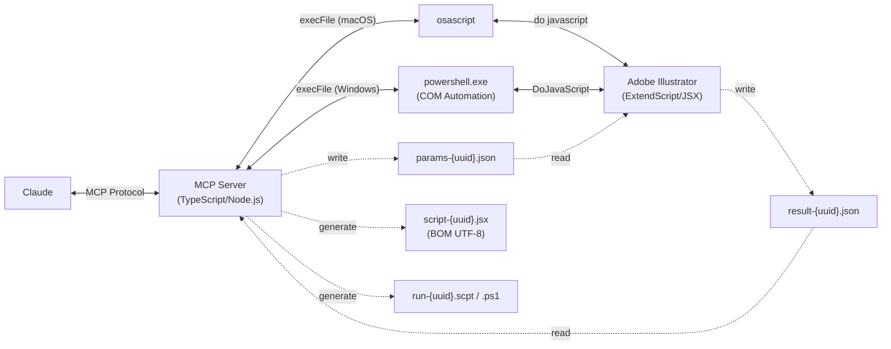

**[日本語版はこちら / Japanese version](README.ja.md)**

# Illustrator MCP Server

[](https://www.npmjs.com/package/illustrator-mcp-server)
[](LICENSE)
[]()
[](https://www.adobe.com/products/illustrator.html)
[](https://modelcontextprotocol.io/)
[](https://buymeacoffee.com/cyocun)

An [MCP (Model Context Protocol)](https://modelcontextprotocol.io/) server for reading, manipulating, and exporting Adobe Illustrator design data.

Control Illustrator directly from AI assistants like Claude — extract design information for web implementation, verify print-ready data, and export assets.

[](https://glama.ai/mcp/servers/ie3jp/illustrator-mcp-server)

---

## Usage Examples

**Extracting design data:**
```
You:    Show me all the text information in this document
Claude:  → list_text_frames → get_text_frame_detail
         There are 12 text frames in the document.
         The heading "My Design" uses Noto Sans JP Bold 48px, color #333333 ...
```

**SVG export:**
```
You:    Export the "pc" artboard as SVG with outlined text
Claude:  → get_artboards → export
         Exported to /path/to/output.svg (text converted to outlines)
```

**Pre-press preflight:**
```
You:    Run a pre-press preflight check
Claude:  → preflight_check
         ⚠ 2 warnings:
         - Low resolution image: image_01.jpg (150dpi) — 300dpi or higher recommended
         - Non-outlined fonts: 3 text frames
```

**Object manipulation:**
```
You:    Create a red rectangle and place it in the top-left corner
Claude:  → create_rectangle
         Created a 200×100 red rectangle at (0, 0) (uuid: abc-123...)
```

---

## Features

- **30 tools** — 16 read / 11 modify / 2 export / 1 utility
- **Web coordinate system** — Y-axis down, artboard-relative (same as CSS/SVG)
- **UUID tracking** — Stable object identification across tool calls

---

## Prerequisites

- **macOS** (osascript) or **Windows** (PowerShell COM automation — not yet tested on real hardware)
- **Adobe Illustrator CC 2024+**
- **Node.js 20+** to run the built package
- **Node.js 24+** for development from source, because this repository uses `vp` and Node's TypeScript execution workflow during local development
- **Vite+ (`vp`)** — Install globally with `curl -fsSL https://vite.plus | bash`, then open a new shell and verify with `vp help`.

> **macOS:** On first run, allow automation access in System Settings > Privacy & Security > Automation.

> **Note:** Modify and export tools will bring Illustrator to the foreground during execution. Illustrator requires being the active application to process these operations.

---

## Setup

### Claude Code

```bash
claude mcp add illustrator-mcp -- npx illustrator-mcp-server
```

### Claude Desktop

Add to `claude_desktop_config.json`:
- macOS: `~/Library/Application Support/Claude/claude_desktop_config.json`
- Windows: `%APPDATA%\Claude\claude_desktop_config.json`

```json
{
  "mcpServers": {
    "illustrator": {
      "command": "npx",
      "args": ["illustrator-mcp-server"]
    }
  }
}
```

After saving, restart Claude Desktop. The MCP server indicator (hammer icon) should appear in the input area.

### From source

```bash
git clone https://github.com/ie3jp/illustrator-mcp-server.git
cd illustrator-mcp-server
vp install
vp pack
claude mcp add illustrator-mcp -- node /path/to/illustrator-mcp-server/dist/index.js
```

The built output in `dist/` is intended to run on Node.js 20+. The source tree and local developer workflow assume Node.js 24+.

### Verify

```bash
npx @modelcontextprotocol/inspector npx illustrator-mcp-server
```

---

## Tool Reference

### Read Tools (16)

<details>
<summary>Click to expand</summary>

| Tool | Description |
|---|---|
| `get_document_info` | Document metadata (dimensions, color mode, profile, etc.) |
| `get_artboards` | Artboard information (position, size, orientation) |
| `get_layers` | Layer structure as a tree |
| `get_document_structure` | Full tree: layers → groups → objects in one call |
| `list_text_frames` | List of text frames (font, size, style name) |
| `get_text_frame_detail` | All attributes of a specific text frame (kerning, paragraph settings, etc.) |
| `get_colors` | Color information in use (swatches, gradients, spot colors, etc.) |
| `get_path_items` | Path/shape data (fill, stroke, anchor points) |
| `get_groups` | Groups, clipping masks, and compound path structure |
| `get_effects` | Effects and appearance info (opacity, blend mode) |
| `get_images` | Embedded/linked image info (resolution, broken link detection) |
| `get_symbols` | Symbol definitions and instances |
| `get_guidelines` | Guide information |
| `get_overprint_info` | Overprint settings for path items |
| `get_selection` | Details of currently selected objects |
| `find_objects` | Search by criteria (name, type, color, font, etc.) |

</details>

### Modify Tools (11)

<details>
<summary>Click to expand</summary>

| Tool | Description |
|---|---|
| `create_rectangle` | Create a rectangle (supports rounded corners) |
| `create_ellipse` | Create an ellipse |
| `create_line` | Create a line |
| `create_text_frame` | Create a text frame (point or area type) |
| `create_path` | Create a custom path (with Bezier handles) |
| `place_image` | Place an image file as linked or embedded |
| `modify_object` | Modify properties of an existing object |
| `convert_to_outlines` | Convert text to outlines |
| `apply_color_profile` | Apply a color profile |
| `create_document` | Create a new document (size, color mode) |
| `close_document` | Close the active document |

</details>

### Export Tools (2)

| Tool | Description |
|---|---|
| `export` | SVG / PNG / JPG export (by artboard, selection, or UUID) |
| `export_pdf` | Print-ready PDF export (crop marks, bleed, downsampling) |

### Utility (1)

| Tool | Description |
|---|---|
| `preflight_check` | Pre-press check (RGB mixing, broken links, low resolution, white overprint, etc.) |

---

## Architecture



### Coordinate System

Geometry-aware read and modify tools accept a `coordinate_system` parameter. Export and document-wide utility tools do not, because their behavior does not depend on coordinate conversion.

| Value | Origin | Y-axis | Use case |
|---|---|---|---|
| `artboard-web` (default) | Artboard top-left | Positive downward | Web / CSS implementation |
| `document` | Pasteboard | Positive upward (Illustrator native) | Print / DTP |

---

## Testing

```bash
# Lint, format, and type-check
vp check

# Unit tests
vp test run

# Package the server
vp pack

# Integration check (requires Illustrator running with an open document)
vp run test:integration

# E2E smoke test (requires Illustrator running)
vp run test:smoke
```

The E2E test creates a fresh document, places test objects (shapes, text, linked/embedded images), runs all 45 test cases across 5 phases, and cleans up automatically. No pre-existing files required.

---

## Known Limitations

| Limitation | Details |
|---|---|
| macOS / Windows | macOS uses osascript, Windows uses PowerShell COM automation (not yet tested on real hardware) |
| Live effects | ExtendScript DOM limitations prevent reading parameters for drop shadows, etc. |
| Color profile conversion | Only profile assignment is supported; full ICC conversion is not available |
| Bleed settings | Not accessible via the ExtendScript API (undocumented) |
| WebP export | Not supported — ExportType does not include WebP in ExtendScript |
| Japanese crop marks | `PageMarksTypes.Japanese` may not be applied correctly in PDF export |

---

## Project Structure

```
illustrator-mcp-server/
├── src/
│   ├── index.ts              # Entry point
│   ├── server.ts             # MCP server
│   ├── executor/
│   │   ├── jsx-runner.ts     # Transport selection + concurrency control
│   │   └── file-transport.ts # Temp file management (macOS/Windows)
│   ├── tools/
│   │   ├── registry.ts       # Tool registration
│   │   ├── read/             # 16 read tools
│   │   ├── modify/           # 11 modify tools
│   │   ├── export/           # 2 export tools
│   │   └── utility/          # 1 utility tool
│   ├── utils/
│   │   └── image-header.ts  # Image format detection
│   └── jsx/
│       └── helpers/
│           └── common.jsx    # ExtendScript common helpers
├── test/
│   ├── unit/                 # Unit tests
│   └── e2e/
│       └── smoke-test.ts     # E2E smoke test
└── docs/                     # Design documents
```

---

## Support

If this tool helps your workflow, [buy me a beer 🍺](https://buymeacoffee.com/cyocun)

---

## License

[MIT](LICENSE)
