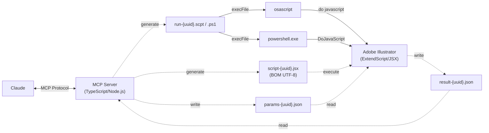

[🇺🇸 English](README.md) | [🇯🇵 日本語](README.ja.md) | [🇨🇳 简体中文](README.zh-CN.md) | [🇰🇷 한국어](README.ko.md) | [🇪🇸 Español](README.es.md) | [🇩🇪 Deutsch](README.de.md) | [🇫🇷 Français](README.fr.md) | **🇵🇹 Português (BR)**

# Illustrator MCP Server

[](https://www.npmjs.com/package/illustrator-mcp-server)
[](LICENSE)
[]()
[](https://www.adobe.com/products/illustrator.html)
[](https://modelcontextprotocol.io/)
[](https://ko-fi.com/cyocun)

Um servidor [MCP (Model Context Protocol)](https://modelcontextprotocol.io/) para ler, manipular e exportar dados de design do Adobe Illustrator — com 63 ferramentas integradas.

Controle o Illustrator diretamente a partir de assistentes de IA como o Claude — extraia informações de design para implementação web, verifique dados prontos para impressão e exporte assets.

[](https://glama.ai/mcp/servers/ie3jp/illustrator-mcp-server)

---

## 🎨 Galeria

Todas as artes abaixo foram criadas inteiramente pelo Claude por meio de conversa em linguagem natural — sem qualquer operação manual no Illustrator.

<table>
<tr>
<td align="center"><br><b>Pôster de Evento</b></td>
<td align="center"><br><b>Conceitos de Logo</b></td>
</tr>
<tr>
<td align="center"><br><b>Cartão de Visita</b></td>
<td align="center"><br><b>Twilight Geometry</b></td>
</tr>
</table>

> Veja os [detalhamentos completos](#exemplo-padrão-de-teste-smpte) abaixo para prompts, uso de ferramentas e estrutura de pranchetas.

---

> [!TIP]
> Desenvolver e manter esta ferramenta consome tempo e recursos.
> Se ela ajuda no seu fluxo de trabalho, seu apoio significa muito — [☕ me pague um café!](https://ko-fi.com/cyocun)

---

## 🚀 Início Rápido

### 🛠️ Claude Code

Requer [Node.js 20+](https://nodejs.org/).

```bash
claude mcp add illustrator-mcp -- npx illustrator-mcp-server
```

### 🖥️ Claude Desktop

1. Baixe o **`illustrator-mcp-server.mcpb`** em [GitHub Releases](https://github.com/ie3jp/illustrator-mcp-server/releases/latest)
2. Abra o Claude Desktop → **Settings** → **Extensions**
3. Arraste e solte o arquivo `.mcpb` no painel de Extensions
4. Clique no botão **Install**

<details>
<summary><strong>Alternativa: configuração manual (sempre atualizada via npx)</strong></summary>

> [!NOTE]
> A extensão `.mcpb` não se atualiza automaticamente. Para atualizar, baixe a nova versão e reinstale. Se preferir atualizações automáticas, use o método npx abaixo.

Requer [Node.js 20+](https://nodejs.org/). Abra o arquivo de configuração e adicione as definições de conexão.

#### 1. Abra o arquivo de configuração

Na barra de menu do Claude Desktop:

**Claude** → **Settings...** → **Developer** (na barra lateral esquerda) → clique no botão **Edit Config**

#### 2. Adicione as configurações

```json
{
  "mcpServers": {
    "illustrator": {
      "command": "npx",
      "args": ["illustrator-mcp-server"]
    }
  }
}
```

> [!NOTE]
> Se você instalou o Node.js por meio de um gerenciador de versões (nvm, mise, fnm, etc.), o Claude Desktop pode não encontrar o `npx`. Nesse caso, use o caminho completo:
> ```json
> "command": "/caminho/completo/ate/npx"
> ```
> Execute `which npx` no terminal para encontrar o caminho.

#### 3. Salve e reinicie

1. Salve o arquivo e feche o editor de texto
2. **Saia completamente** do Claude Desktop (⌘Q / Ctrl+Q) e reabra

</details>

> [!CAUTION]
> A IA pode cometer erros. Não dependa excessivamente do resultado — **sempre tenha uma pessoa fazendo a verificação final dos dados de envio**. O usuário é responsável pelos resultados.

> [!NOTE]
> **macOS:** Na primeira execução, permita o acesso de automação em Ajustes do Sistema > Privacidade e Segurança > Automação.

> [!NOTE]
> As ferramentas de modificação e exportação trarão o Illustrator para o primeiro plano durante a execução.

### Múltiplas versões do Illustrator

Se você tem várias versões do Illustrator instaladas, pode dizer ao Claude qual versão usar durante a conversa. Basta dizer algo como "Use o Illustrator 2024" e a ferramenta `set_illustrator_version` direcionará para essa versão.

> [!NOTE]
> Se o Illustrator já estiver em execução, o servidor se conecta à instância em execução independentemente da configuração de versão. A versão só é usada para iniciar a versão correta quando o Illustrator ainda não está em execução.

---

## 🎬 O Que Você Pode Fazer

```
Você:    Mostre-me todas as informações de texto deste documento
Claude:  → list_text_frames → get_text_frame_detail
         Existem 12 frames de texto no documento.
         O título "My Design" usa Noto Sans JP Bold 48px, cor #333333 ...
```

```
Você:    Execute uma verificação preflight de pré-impressão
Claude:  → preflight_check
         ⚠ 2 avisos:
         - Imagem de baixa resolução: image_01.jpg (150dpi) — recomendado 300dpi ou mais
         - Fontes não convertidas em curvas: 3 frames de texto
```

```
Você:    Verifique inconsistências no texto
Claude:  → check_text_consistency
         📝 Relatório de Consistência:
         ⚠ "Contact Us" vs "Contact us" — diferença de capitalização
         ❌ "Lorem ipsum" (2 locais) — texto placeholder ainda presente
```

```
Você:    Crie variações de tamanho de banner a partir deste panfleto A4
Claude:  → get_document_info → resize_for_variation
         Criadas 3 variações de tamanho:
         - 728×90 / 300×250 / 160×600
```

---

## 📖 Receitas

<details>
<summary><b>Extrair cores e fontes para CSS</b></summary>

```
Você:    Resuma as cores e a tipografia deste design

Claude:  → get_colors → list_text_frames → get_text_frame_detail

         ■ Paleta de Cores
         - Primária: #1A73E8 (CMYK: 85,50,0,0)
         - Secundária: #34A853
         - Texto: #202124
         - Fundo: #FFFFFF

         ■ Tipografia
         - Títulos: Noto Sans JP Bold / 32px
         - Corpo: Noto Sans JP Regular / 16px / line-height: 1.75
         - Legendas: Noto Sans JP Medium / 12px
```

</details>

<details>
<summary><b>Exportar pranchetas como SVG / PNG</b></summary>

```
Você:    Exporte todas as pranchetas como SVG com texto convertido em curvas

Claude:  → get_artboards → convert_to_outlines → export (repetido)

         4 pranchetas exportadas:
         - /output/header.svg
         - /output/hero.svg
         - /output/feature.svg
         - /output/footer.svg
```

</details>

<details>
<summary><b>Verificar conformidade PDF/X-1a antes do envio</b></summary>

```
Você:    Verifique se este documento está em conformidade com PDF/X-1a

Claude:  → preflight_check (target_pdf_profile: "x1a")

         ❌ Erros de conformidade PDF/X-1a:
         - Transparência em 3 objetos (X-1a proíbe transparência)
         - Cores RGB encontradas em 2 locais (X-1a requer apenas CMYK/cores especiais)

         ⚠ Avisos:
         - 5 fontes não convertidas em curvas (incorporação recomendada)
         - Imagem "photo_02.jpg" a 150dpi (300dpi recomendado)
```

</details>

<details>
<summary><b>Verificar qualidade de imagem para impressão</b></summary>

```
Você:    Verifique a qualidade das imagens inseridas para impressão

Claude:  → get_images (include_print_info: true)

         ■ Relatório de Qualidade de Imagem:
         ✅ hero.psd — CMYK, 350dpi, escala 98%
         ⚠ icon_set.png — RGB (incompatível com documento CMYK), 300dpi, escala 100%
         ❌ photo_bg.jpg — CMYK, 72dpi, escala 400% (ampliada em excesso)
           → Substituir por imagem de 300dpi+ em tamanho real
```

</details>

<details>
<summary><b>Verificar razões de contraste de cor WCAG</b></summary>

```
Você:    Verifique as razões de contraste do texto

Claude:  → check_contrast (auto_detect: true)

         ■ Relatório de Contraste WCAG:
         ❌ "Caption" sobre "cinza claro" — 2.8:1 (AA reprovado)
         ⚠ "Subheading" sobre "branco" — 4.2:1 (AA Large OK, AA Normal reprovado)
         ✅ "Body text" sobre "branco" — 12.1:1 (AAA aprovado)
```

</details>

---

## Templates de Fluxo de Trabalho

Templates de fluxo de trabalho pré-construídos, disponíveis no seletor de prompts do Claude Desktop.

| Template | Descrição |
|----------|-----------|
| `quick-layout` | Cole o conteúdo de texto e o Claude o organiza na prancheta como títulos, corpo e legendas |
| `print-preflight-workflow` | Verificação completa de pré-impressão em 7 passos (documento → preflight → sobreimpressão → separações → imagens → cores → texto) |

---

## Referência de Ferramentas

### Ferramentas de Leitura (21)

<details>
<summary>Clique para expandir</summary>

| Ferramenta | Descrição |
|---|---|
| `get_document_info` | Metadados do documento (dimensões, modo de cor, perfil, etc.) |
| `get_artboards` | Informações de pranchetas (posição, tamanho, orientação) |
| `get_layers` | Estrutura de camadas em formato de árvore |
| `get_document_structure` | Árvore completa: camadas → grupos → objetos em uma única chamada |
| `list_text_frames` | Lista de frames de texto (fonte, tamanho, nome do estilo) |
| `get_text_frame_detail` | Todos os atributos de um frame de texto específico (kerning, configurações de parágrafo, etc.) |
| `get_colors` | Informações de cores em uso (amostras, gradientes, cores especiais). `include_diagnostics` para análise de impressão |
| `get_path_items` | Dados de paths/formas (preenchimento, traço, pontos de ancoragem) |
| `get_groups` | Grupos, máscaras de recorte e estrutura de paths compostos |
| `get_effects` | Efeitos e informações de aparência (opacidade, modo de mesclagem) |
| `get_images` | Informações de imagens incorporadas/vinculadas (resolução, detecção de links quebrados). `include_print_info` para incompatibilidade de espaço de cor e fator de escala |
| `get_symbols` | Definições e instâncias de símbolos |
| `get_guidelines` | Informações de guias |
| `get_overprint_info` | Configurações de sobreimpressão + detecção de K100/preto rico e classificação de intenção |
| `get_separation_info` | Informações de separação de cores (placas de processo CMYK + placas de cores especiais com contagem de uso) |
| `get_selection` | Detalhes dos objetos atualmente selecionados |
| `find_objects` | Busca por critérios (nome, tipo, cor, fonte, etc.) |
| `check_contrast` | Verificação de razão de contraste de cor WCAG (manual ou detecção automática de pares sobrepostos) |
| `extract_design_tokens` | Extrai design tokens como CSS custom properties, JSON ou configuração do Tailwind |
| `list_fonts` | Lista as fontes disponíveis no Illustrator (não requer documento aberto) |
| `convert_coordinate` | Converte pontos entre os sistemas de coordenadas de prancheta e documento |

</details>

### Ferramentas de Modificação (38)

<details>
<summary>Clique para expandir</summary>

| Ferramenta | Descrição |
|---|---|
| `create_rectangle` | Cria um retângulo (suporta cantos arredondados) |
| `create_ellipse` | Cria uma elipse |
| `create_line` | Cria uma linha |
| `create_text_frame` | Cria um frame de texto (ponto ou área) |
| `create_path` | Cria um path customizado (com alças Bezier) |
| `place_image` | Insere um arquivo de imagem como vinculado ou incorporado |
| `modify_object` | Modifica propriedades de um objeto existente |
| `convert_to_outlines` | Converte texto em curvas |
| `assign_color_profile` | Atribui (marca) um perfil de cor (não converte os valores de cor) |
| `create_document` | Cria um novo documento (tamanho, modo de cor) |
| `close_document` | Fecha o documento ativo |
| `resize_for_variation` | Cria variações de tamanho a partir de uma prancheta de origem (escala proporcional) |
| `align_objects` | Alinha e distribui múltiplos objetos |
| `replace_color` | Localiza e substitui cores em todo o documento (com tolerância) |
| `manage_layers` | Adiciona, renomeia, mostra/esconde, bloqueia/desbloqueia, reordena ou exclui camadas |
| `place_color_chips` | Extrai cores únicas e posiciona amostras de color chips fora da prancheta |
| `save_document` | Salva ou salva como do documento ativo |
| `open_document` | Abre um documento a partir de um caminho de arquivo |
| `group_objects` | Agrupa objetos (suporta máscaras de recorte) |
| `ungroup_objects` | Desagrupa um grupo, liberando os filhos |
| `duplicate_objects` | Duplica objetos com deslocamento opcional |
| `set_z_order` | Muda a ordem de empilhamento (frente/fundo) |
| `move_to_layer` | Move objetos para outra camada |
| `manage_artboards` | Adiciona, remove, redimensiona, renomeia, reorganiza pranchetas |
| `manage_swatches` | Adiciona, atualiza ou exclui amostras de cor |
| `manage_linked_images` | Re-vincula ou incorpora imagens inseridas |
| `manage_datasets` | Lista/aplica/cria datasets, importa/exporta variáveis |
| `apply_graphic_style` | Aplica um estilo gráfico aos objetos |
| `list_graphic_styles` | Lista todos os estilos gráficos do documento |
| `apply_text_style` | Aplica estilo de caractere ou parágrafo ao texto |
| `list_text_styles` | Lista todos os estilos de caractere e parágrafo |
| `create_gradient` | Cria gradientes e aplica aos objetos |
| `create_path_text` | Cria texto ao longo de um path |
| `place_symbol` | Insere ou substitui instâncias de símbolos |
| `select_objects` | Seleciona objetos por UUID (seleção múltipla suportada) |
| `create_crop_marks` | Cria marcas de corte com detecção automática de estilo por locale (linha dupla japonesa / linha única ocidental) |
| `place_style_guide` | Posiciona um guia de estilo visual fora da prancheta (cores, fontes, espaçamentos, margens, distâncias entre guias) |
| `undo` | Operações de undo/redo (múltiplos passos) |

</details>

### Ferramentas de Exportação (2)

<details>
<summary>Clique para expandir</summary>

| Ferramenta | Descrição |
|---|---|
| `export` | Exportação SVG / PNG / JPG (por prancheta, seleção ou UUID) |
| `export_pdf` | Exportação de PDF pronto para impressão (marcas de corte, sangria, downsampling seletivo, output intent) |

</details>

### Utilitários (3)

<details>
<summary>Clique para expandir</summary>

| Ferramenta | Descrição |
|---|---|
| `preflight_check` | Verificação preflight de pré-impressão (mistura de RGB, links quebrados, baixa resolução, sobreimpressão branca, interação transparência+sobreimpressão, conformidade PDF/X, etc.) |
| `check_text_consistency` | Verificação de consistência de texto (detecção de placeholders, padrões de variação de grafia, listagem completa de texto para análise por LLM) |
| `set_workflow` | Define o modo de fluxo de trabalho (web/print) para sobrescrever o sistema de coordenadas detectado automaticamente |

</details>

---

## Sistema de Coordenadas

O servidor detecta automaticamente o sistema de coordenadas a partir do documento:

| Tipo de documento | Sistema de coordenadas | Origem | Eixo Y |
|---|---|---|---|
| CMYK / Impressão | `document` | Inferior esquerdo | Para cima |
| RGB / Web | `artboard-web` | Superior esquerdo da prancheta | Para baixo |

- **Documentos CMYK** usam o sistema de coordenadas nativo do Illustrator, coincidindo com o que designers de impressão esperam
- **Documentos RGB** usam um sistema de coordenadas estilo web, mais fácil para a IA trabalhar
- Use `set_workflow` para sobrescrever o sistema detectado automaticamente, se necessário
- Todas as respostas das ferramentas incluem um campo `coordinateSystem` indicando qual sistema está ativo

---

## Exemplo: Padrão de Teste SMPTE

Um padrão de teste de barras de cor SMPTE 1920×1080, criado inteiramente por meio de instruções em linguagem natural ao Claude.

**Prompt:**

> Faça um padrão de teste de vídeo em 1920x1080

**Resultado:**


**Estrutura da prancheta** (via `get_document_structure`):

<details>
<summary>Clique para expandir</summary>

```
Labels
├── title-safe-label        (text)    — "TITLE SAFE (10%)"
├── action-safe-label       (text)    — "ACTION SAFE (5%)"
├── credit-label            (text)    — "Generated by illustrator-mcp-server"
├── test-label              (text)    — "SMPTE COLOR BARS — TEST PATTERN"
├── format-label            (text)    — "Full HD — 16:9"
└── resolution-label        (text)    — "1920 x 1080"

Center Cross
├── title-safe              (path)    — 1536×864 stroke rectangle
├── action-safe             (path)    — 1728×972 stroke rectangle
├── cross-circle            (path)    — 150×150 center circle
├── cross-v                 (path)    — vertical crosshair
└── cross-h                 (path)    — horizontal crosshair

Color Bars
├── pluge-black … pluge-navy   (path ×9)  — PLUGE / grayscale bottom strip
├── rev-white … rev-blue       (path ×7)  — reverse color middle strip
└── bar-white … bar-blue       (path ×7)  — 75% SMPTE color bars
```

</details>

> Ferramentas utilizadas: `create_document`, `manage_layers`, `create_rectangle` ×23, `create_line` ×2, `create_ellipse`, `create_text_frame` ×6, `modify_object` ×4, `save_document`, `export`

---

## Exemplo: Twilight Geometry

Uma arte de paisagem geométrica abstrata — criada inteiramente pelo Claude, sem qualquer direção de design humana além de "faça a arte que quiser".

**Prompt:**

> Crie uma obra de arte a partir da sua própria imaginação no Illustrator. Não tenha pressa. Faça o que quiser.

**Processo do Claude:**

> Vou criar "Twilight Geometry" — uma paisagem abstrata com elementos celestes geométricos. Um céu crepuscular com gradiente profundo, silhuetas de montanhas em camadas, uma lua crescente com anéis decorativos e estrelas espalhadas pela tela.

> Estrelas em formato de diamante em diferentes cores — brancos quentes, azuis frios, lavandas — cada uma sutilmente diferente para sugerir diferentes tipos de estrelas. Linhas de constelações conectando-as. Triângulos em wireframe e um hexágono flutuando no céu para um clima místico.

> Uma superfície de água na parte inferior com a luz da lua refletida em linhas onduladas cintilantes, que vão se desvanecendo à medida que descem.

**Reflexão do Claude:**

> Ficou melhor do que eu esperava. Acho que o mundo híbrido entre geometria e natureza foi bem transmitido.

**Resultado:**


> Ferramentas utilizadas: `create_document`, `manage_layers` ×4, `create_rectangle` ×2, `create_gradient` ×2, `create_path` ×11, `create_ellipse` ×14, `create_line` ×4, `create_text_frame` ×2, `modify_object`, `set_z_order`, `export`

---

## Limitações Conhecidas

| Limitação | Detalhes |
|---|---|
| Suporte ao Windows | Windows usa automação COM via PowerShell (ainda não testado em hardware real) |
| Live effects | Parâmetros de sombra projetada e outros efeitos podem ser detectados, mas não lidos |
| Perfis de cor | Apenas atribuição de perfil de cor — conversão completa não está disponível |
| Configurações de sangria | Configurações de sangria não podem ser lidas (limitação da API do Illustrator) |
| Exportação WebP | Não suportado — use PNG ou SVG em vez disso |
| Marcas de corte japonesas | A exportação em PDF usa automaticamente a abordagem via comando TrimMark: gera as marcas como paths do documento, exporta e depois as remove via undo |
| Incorporação de fontes | O modo de incorporação (full/subset) não pode ser controlado diretamente — use PDF presets |
| Variações de tamanho | Apenas escala proporcional — o texto pode precisar de ajuste manual posteriormente |

---

<br>

# Para Desenvolvedores

## Arquitetura



---

## Build a partir do código-fonte

```bash
git clone https://github.com/ie3jp/illustrator-mcp-server.git
cd illustrator-mcp-server
npm install
npm run build
claude mcp add illustrator-mcp -- node /path/to/illustrator-mcp-server/dist/index.js
```

### Verificação

```bash
npx @modelcontextprotocol/inspector npx illustrator-mcp-server
```

### Testes

```bash
# Testes unitários
npm test

# Smoke test E2E (requer Illustrator em execução)
npx tsx test/e2e/smoke-test.ts
```

O teste E2E cria documentos novos (RGB + CMYK), insere objetos de teste, executa 182 casos de teste em 10 fases que cobrem todas as ferramentas registradas e a detecção automática do sistema de coordenadas, e faz a limpeza automaticamente.

---

## Aviso Legal

Esta ferramenta automatiza muitas operações do Illustrator, mas a IA pode cometer erros. Dados extraídos, resultados de preflight e modificações de documento devem sempre ser revisados por uma pessoa. **Não confie nesta ferramenta como sua única verificação de qualidade.** Use-a como assistente junto com sua própria verificação manual, especialmente para envios a gráficas e entregas a clientes. Os autores não se responsabilizam por quaisquer danos ou perdas decorrentes do uso deste software ou de seus resultados.

---

## Licença

[MIT](LICENSE)
