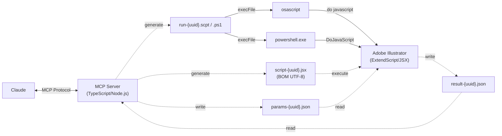

[🇺🇸 English](README.md) | [🇯🇵 日本語](README.ja.md) | **🇨🇳 简体中文** | [🇰🇷 한국어](README.ko.md) | [🇪🇸 Español](README.es.md) | [🇩🇪 Deutsch](README.de.md) | [🇫🇷 Français](README.fr.md) | [🇵🇹 Português (BR)](README.pt-BR.md)

# Illustrator MCP Server

[](https://www.npmjs.com/package/illustrator-mcp-server)
[](LICENSE)
[]()
[](https://www.adobe.com/products/illustrator.html)
[](https://modelcontextprotocol.io/)
[](https://ko-fi.com/cyocun)

一个用于读取、操作和导出 Adobe Illustrator 设计数据的 [MCP（Model Context Protocol）](https://modelcontextprotocol.io/) 服务器 —— 内置 63 个工具。

通过 Claude 等 AI 助手直接控制 Illustrator —— 提取设计信息用于 Web 实现、验证印前数据、导出素材资源。

[](https://glama.ai/mcp/servers/ie3jp/illustrator-mcp-server)

---

## 🎨 作品展示

以下所有作品均由 Claude 通过自然语言对话完整创建 —— 完全没有手动操作 Illustrator。

<table>
<tr>
<td align="center"><br><b>活动海报</b></td>
<td align="center"><br><b>Logo 方案</b></td>
</tr>
<tr>
<td align="center"><br><b>名片</b></td>
<td align="center"><br><b>Twilight Geometry</b></td>
</tr>
</table>

> 关于提示词、工具调用和画板结构的说明，请查看下方的[详细解析](#示例smpte-测试图案)。

---

> [!TIP]
> 开发和维护此工具需要投入大量时间与精力。
> 如果它对你的工作有帮助，你的支持将意义重大 —— [☕ 请我喝杯咖啡！](https://ko-fi.com/cyocun)

---

## 🚀 快速开始

### 🛠️ Claude Code

需要 [Node.js 20+](https://nodejs.org/)。

```bash
claude mcp add illustrator-mcp -- npx illustrator-mcp-server
```

### 🖥️ Claude Desktop

1. 从 [GitHub Releases](https://github.com/ie3jp/illustrator-mcp-server/releases/latest) 下载 **`illustrator-mcp-server.mcpb`**
2. 打开 Claude Desktop → **Settings** → **Extensions**
3. 将 `.mcpb` 文件拖放到扩展面板中
4. 点击 **Install** 按钮

<details>
<summary><strong>替代方案：手动配置（通过 npx 保持最新）</strong></summary>

> [!NOTE]
> `.mcpb` 扩展不会自动更新。若要升级，请下载新版本并重新安装。如果你希望自动更新，请改用下面的 npx 方式。

需要 [Node.js 20+](https://nodejs.org/)。打开配置文件并添加连接设置。

#### 1. 打开配置文件

从 Claude Desktop 菜单栏：

**Claude** → **Settings...** → **Developer**（左侧栏）→ 点击 **Edit Config** 按钮

#### 2. 添加设置

```json
{
  "mcpServers": {
    "illustrator": {
      "command": "npx",
      "args": ["illustrator-mcp-server"]
    }
  }
}
```

> [!NOTE]
> 如果你通过版本管理工具（nvm、mise、fnm 等）安装了 Node.js，Claude Desktop 可能无法找到 `npx`。这种情况下请使用完整路径：
> ```json
> "command": "/full/path/to/npx"
> ```
> 在终端中运行 `which npx` 可获得路径。

#### 3. 保存并重启

1. 保存文件并关闭文本编辑器
2. **完全退出** Claude Desktop（⌘Q / Ctrl+Q）后重新打开

</details>

> [!CAUTION]
> AI 可能会出错。不要过度依赖其输出 —— **送印数据必须始终由人工进行最终检查**。使用者需自行为结果负责。

> [!NOTE]
> **macOS：** 首次运行时，请在「系统设置 > 隐私与安全性 > 自动化」中授权自动化访问权限。

> [!NOTE]
> 修改和导出类工具在执行时会将 Illustrator 切换到前台。

### 多版本 Illustrator

如果你安装了多个版本的 Illustrator，可以在对话中告诉 Claude 使用哪个版本。只需说「使用 Illustrator 2024」之类的话，`set_illustrator_version` 工具就会指向相应版本。

> [!NOTE]
> 如果 Illustrator 已经在运行，服务器会连接到当前运行的实例，与版本设置无关。版本设置仅在 Illustrator 尚未启动时用于启动指定版本。

---

## 🎬 能做什么

```
你：   告诉我这个文档中所有的文本信息
Claude:  → list_text_frames → get_text_frame_detail
         文档中共有 12 个文本框。
         标题 "My Design" 使用 Noto Sans JP Bold 48px，颜色 #333333 ...
```

```
你：   运行一次印前预检
Claude:  → preflight_check
         ⚠ 2 条警告：
         - 低分辨率图像：image_01.jpg (150dpi) —— 建议使用 300dpi 或更高
         - 未轮廓化的字体：3 个文本框
```

```
你：   检查文本是否存在不一致
Claude:  → check_text_consistency
         📝 一致性报告：
         ⚠ "Contact Us" 与 "Contact us" —— 大小写不一致
         ❌ "Lorem ipsum"（2 处）—— 存在占位符文本
```

```
你：   基于这份 A4 传单创建横幅尺寸的变体
Claude:  → get_document_info → resize_for_variation
         已创建 3 种尺寸变体：
         - 728×90 / 300×250 / 160×600
```

---

## 📖 使用示例

<details>
<summary><b>提取颜色和字体用于 CSS</b></summary>

```
你：   总结这份设计中的颜色和字体排版

Claude:  → get_colors → list_text_frames → get_text_frame_detail

         ■ 色彩方案
         - 主色：#1A73E8 (CMYK: 85,50,0,0)
         - 辅助色：#34A853
         - 文字：#202124
         - 背景：#FFFFFF

         ■ 字体排版
         - 标题：Noto Sans JP Bold / 32px
         - 正文：Noto Sans JP Regular / 16px / line-height: 1.75
         - 说明文字：Noto Sans JP Medium / 12px
```

</details>

<details>
<summary><b>将画板导出为 SVG / PNG</b></summary>

```
你：   将所有画板以 SVG 格式导出，文本轮廓化

Claude:  → get_artboards → convert_to_outlines → export（多次）

         已导出 4 个画板：
         - /output/header.svg
         - /output/hero.svg
         - /output/feature.svg
         - /output/footer.svg
```

</details>

<details>
<summary><b>送印前检查 PDF/X-1a 合规性</b></summary>

```
你：   检查这份文档是否符合 PDF/X-1a 规范

Claude:  → preflight_check (target_pdf_profile: "x1a")

         ❌ PDF/X-1a 合规性错误：
         - 3 个对象存在透明效果（X-1a 禁止透明）
         - 发现 2 处 RGB 颜色（X-1a 仅允许 CMYK/专色）

         ⚠ 警告：
         - 5 个未轮廓化的字体（建议嵌入）
         - 图像 "photo_02.jpg" 仅 150dpi（建议 300dpi）
```

</details>

<details>
<summary><b>检查印刷用图像质量</b></summary>

```
你：   检查印刷用置入图像的质量

Claude:  → get_images (include_print_info: true)

         ■ 图像质量报告：
         ✅ hero.psd —— CMYK, 350dpi, 缩放 98%
         ⚠ icon_set.png —— RGB（与 CMYK 文档不一致），300dpi，缩放 100%
         ❌ photo_bg.jpg —— CMYK, 72dpi, 缩放 400%（过度放大）
           → 请替换为实际尺寸下 300dpi 以上的图像
```

</details>

<details>
<summary><b>检查 WCAG 色彩对比度</b></summary>

```
你：   检查文本的对比度

Claude:  → check_contrast (auto_detect: true)

         ■ WCAG 对比度报告：
         ❌ "Caption" 位于「浅灰色」之上 —— 2.8:1（AA 不通过）
         ⚠ "Subheading" 位于「白色」之上 —— 4.2:1（AA Large 通过，AA Normal 不通过）
         ✅ "Body text" 位于「白色」之上 —— 12.1:1（AAA 通过）
```

</details>

---

## 工作流模板

预置的工作流模板可在 Claude Desktop 的提示词选择器中调用。

| 模板 | 说明 |
|----------|-------------|
| `quick-layout` | 粘贴文本内容，Claude 会将其作为标题、正文和说明文字排布到画板上 |
| `print-preflight-workflow` | 全面的 7 步印前检查（文档 → 预检 → 叠印 → 分色 → 图像 → 颜色 → 文本） |

---

## 工具参考

### 读取类工具 (21)

<details>
<summary>点击展开</summary>

| 工具 | 说明 |
|---|---|
| `get_document_info` | 文档元数据（尺寸、色彩模式、配置文件等） |
| `get_artboards` | 画板信息（位置、尺寸、方向） |
| `get_layers` | 以树形结构返回图层 |
| `get_document_structure` | 完整树形：一次调用返回图层 → 组 → 对象 |
| `list_text_frames` | 文本框列表（字体、字号、样式名） |
| `get_text_frame_detail` | 指定文本框的全部属性（字距、段落设置等） |
| `get_colors` | 使用中的颜色信息（色板、渐变、专色）。`include_diagnostics` 可用于印刷分析 |
| `get_path_items` | 路径/形状数据（填充、描边、锚点） |
| `get_groups` | 群组、剪切蒙版和复合路径结构 |
| `get_effects` | 效果和外观信息（不透明度、混合模式） |
| `get_images` | 嵌入/链接图像信息（分辨率、链接断开检测）。`include_print_info` 可检测色彩空间不匹配和缩放系数 |
| `get_symbols` | 符号定义与实例 |
| `get_guidelines` | 参考线信息 |
| `get_overprint_info` | 叠印设置 + K100/富黑检测与意图分类 |
| `get_separation_info` | 分色信息（CMYK 印刷版 + 专色版及其使用次数） |
| `get_selection` | 当前选中对象的详细信息 |
| `find_objects` | 按条件搜索（名称、类型、颜色、字体等） |
| `check_contrast` | WCAG 色彩对比度检查（手动或自动检测重叠对） |
| `extract_design_tokens` | 将设计令牌导出为 CSS 自定义属性、JSON 或 Tailwind 配置 |
| `list_fonts` | 列出 Illustrator 中可用的字体（无需文档） |
| `convert_coordinate` | 在画板与文档坐标系之间转换点坐标 |

</details>

### 修改类工具 (38)

<details>
<summary>点击展开</summary>

| 工具 | 说明 |
|---|---|
| `create_rectangle` | 创建矩形（支持圆角） |
| `create_ellipse` | 创建椭圆 |
| `create_line` | 创建直线 |
| `create_text_frame` | 创建文本框（点文字或区域文字） |
| `create_path` | 创建自定义路径（支持贝塞尔控制柄） |
| `place_image` | 以链接或嵌入方式置入图像文件 |
| `modify_object` | 修改现有对象的属性 |
| `convert_to_outlines` | 将文本轮廓化 |
| `assign_color_profile` | 指定（标记）色彩配置文件（不会转换颜色值） |
| `create_document` | 新建文档（尺寸、色彩模式） |
| `close_document` | 关闭当前文档 |
| `resize_for_variation` | 基于源画板创建尺寸变体（等比缩放） |
| `align_objects` | 对齐与分布多个对象 |
| `replace_color` | 在文档中查找并替换颜色（支持容差） |
| `manage_layers` | 添加、重命名、显示/隐藏、锁定/解锁、重新排序或删除图层 |
| `place_color_chips` | 提取唯一颜色并将色卡摆放在画板外 |
| `save_document` | 保存或另存为当前文档 |
| `open_document` | 根据文件路径打开文档 |
| `group_objects` | 将对象编组（支持剪切蒙版） |
| `ungroup_objects` | 解组，释放子对象 |
| `duplicate_objects` | 复制对象（可选偏移量） |
| `set_z_order` | 更改层叠顺序（前/后） |
| `move_to_layer` | 将对象移动到其他图层 |
| `manage_artboards` | 添加、删除、调整大小、重命名、重新排列画板 |
| `manage_swatches` | 添加、更新或删除色板 |
| `manage_linked_images` | 重新链接或嵌入置入的图像 |
| `manage_datasets` | 列出/应用/创建数据集，导入/导出变量 |
| `apply_graphic_style` | 将图形样式应用于对象 |
| `list_graphic_styles` | 列出文档中所有的图形样式 |
| `apply_text_style` | 对文本应用字符样式或段落样式 |
| `list_text_styles` | 列出所有字符样式和段落样式 |
| `create_gradient` | 创建渐变并应用到对象 |
| `create_path_text` | 创建沿路径排列的文本 |
| `place_symbol` | 置入或替换符号实例 |
| `select_objects` | 按 UUID 选中对象（支持多选） |
| `create_crop_marks` | 创建裁切标记（根据区域自动检测样式：日式双线 / 西式单线） |
| `place_style_guide` | 在画板外放置可视化样式指南（颜色、字体、间距、边距、参考线间距） |
| `undo` | 撤销/重做操作（支持多步） |

</details>

### 导出类工具 (2)

<details>
<summary>点击展开</summary>

| 工具 | 说明 |
|---|---|
| `export` | SVG / PNG / JPG 导出（按画板、选区或 UUID） |
| `export_pdf` | 印刷就绪的 PDF 导出（裁切标记、出血、选择性降采样、输出意图） |

</details>

### 实用工具 (3)

<details>
<summary>点击展开</summary>

| 工具 | 说明 |
|---|---|
| `preflight_check` | 印前预检（RGB 混用、链接断开、低分辨率、白色叠印、透明与叠印的相互影响、PDF/X 合规性等） |
| `check_text_consistency` | 文本一致性检查（占位符检测、写法不一致模式识别、提供完整文本列表供 LLM 分析） |
| `set_workflow` | 设置工作流模式（web/print），覆盖自动检测的坐标系 |

</details>

---

## 坐标系

服务器会根据文档自动检测坐标系：

| 文档类型 | 坐标系 | 原点 | Y 轴方向 |
|---|---|---|---|
| CMYK / 印刷 | `document` | 左下 | 向上 |
| RGB / Web | `artboard-web` | 画板左上 | 向下 |

- **CMYK 文档**使用 Illustrator 原生坐标系，与印刷设计师的习惯一致
- **RGB 文档**使用 Web 风格坐标系，更便于 AI 操作
- 如果需要，可用 `set_workflow` 覆盖自动检测的坐标系
- 所有工具响应都会包含 `coordinateSystem` 字段，指示当前生效的坐标系

---

## 示例：SMPTE 测试图案

一张 1920×1080 的 SMPTE 彩条测试图案，完全通过自然语言指令交由 Claude 创建。

**提示词：**

> Make a 1920x1080 video test pattern

**结果：**


**画板结构**（通过 `get_document_structure` 获取）：

<details>
<summary>点击展开</summary>

```
Labels
├── title-safe-label        (text)    — "TITLE SAFE (10%)"
├── action-safe-label       (text)    — "ACTION SAFE (5%)"
├── credit-label            (text)    — "Generated by illustrator-mcp-server"
├── test-label              (text)    — "SMPTE COLOR BARS — TEST PATTERN"
├── format-label            (text)    — "Full HD — 16:9"
└── resolution-label        (text)    — "1920 x 1080"

Center Cross
├── title-safe              (path)    — 1536×864 stroke rectangle
├── action-safe             (path)    — 1728×972 stroke rectangle
├── cross-circle            (path)    — 150×150 center circle
├── cross-v                 (path)    — vertical crosshair
└── cross-h                 (path)    — horizontal crosshair

Color Bars
├── pluge-black … pluge-navy   (path ×9)  — PLUGE / grayscale bottom strip
├── rev-white … rev-blue       (path ×7)  — reverse color middle strip
└── bar-white … bar-blue       (path ×7)  — 75% SMPTE color bars
```

</details>

> 使用的工具：`create_document`、`manage_layers`、`create_rectangle` ×23、`create_line` ×2、`create_ellipse`、`create_text_frame` ×6、`modify_object` ×4、`save_document`、`export`

---

## 示例：Twilight Geometry

一幅抽象的几何风景作品 —— 除了一句「随便创作你喜欢的作品」之外，没有任何人类的设计指导，完全由 Claude 独立创作。

**提示词：**

> Make an art piece of your own imagination in Illustrator. Take your time. Create whatever you like.

**Claude 的创作过程：**

> 我来创作「Twilight Geometry」—— 一幅带有几何天体元素的抽象风景。深邃的渐变暮色天空、层叠的山脉剪影、带有装饰光环的弯月，以及散布在画布上的星星。

> 不同颜色的菱形星星 —— 暖白、冷蓝、淡紫 —— 每一颗都略有差异，以暗示不同类型的恒星。用星座连线将它们相连。天空中漂浮着线框三角形和六边形，营造出神秘氛围。

> 画面底部是水面，月光化作闪烁的波纹线条倒映其上，向下渐渐淡出。

**Claude 的感悟：**

> 成品比我预期的要好。我认为几何与自然相融的混合世界得到了很好的呈现。

**结果：**


> 使用的工具：`create_document`、`manage_layers` ×4、`create_rectangle` ×2、`create_gradient` ×2、`create_path` ×11、`create_ellipse` ×14、`create_line` ×4、`create_text_frame` ×2、`modify_object`、`set_z_order`、`export`

---

## 已知限制

| 限制 | 详情 |
|---|---|
| Windows 支持 | Windows 使用 PowerShell COM 自动化（尚未在真实硬件上测试） |
| 实时效果 | 投影等效果参数可被检测，但无法读取具体值 |
| 色彩配置文件 | 仅支持色彩配置文件的指定 —— 不支持完整转换 |
| 出血设置 | 无法读取出血设置（Illustrator API 限制） |
| WebP 导出 | 不支持 —— 请改用 PNG 或 SVG |
| 日式裁切标记 | PDF 导出会自动采用 TrimMark 命令方案：作为文档路径生成标记、导出后通过撤销移除 |
| 字体嵌入 | 无法直接控制嵌入模式（完整/子集）—— 请使用 PDF 预设 |
| 尺寸变体 | 仅支持等比缩放 —— 文本可能需要事后手动调整 |

---

<br>

# 开发者指南

## 架构



---

## 从源码构建

```bash
git clone https://github.com/ie3jp/illustrator-mcp-server.git
cd illustrator-mcp-server
npm install
npm run build
claude mcp add illustrator-mcp -- node /path/to/illustrator-mcp-server/dist/index.js
```

### 验证

```bash
npx @modelcontextprotocol/inspector npx illustrator-mcp-server
```

### 测试

```bash
# 单元测试
npm test

# 端到端冒烟测试（需要 Illustrator 正在运行）
npx tsx test/e2e/smoke-test.ts
```

E2E 测试会创建全新文档（RGB + CMYK），置入测试对象，运行跨 10 个阶段的 182 个测试用例，覆盖所有已注册的工具和坐标系自动检测，并在结束后自动清理。

---

## 免责声明

本工具自动化了大量 Illustrator 操作，但 AI 可能会出错。提取的数据、预检结果和文档修改应始终由人工复核。**请勿将本工具作为唯一的质量检查手段。** 请将其作为辅助工具，与你自己的手动验证配合使用，尤其是在印刷交付和客户交付物方面。作者不对因使用本软件或其输出所产生的任何损害或损失承担责任。

---

## 许可证

[MIT](LICENSE)
